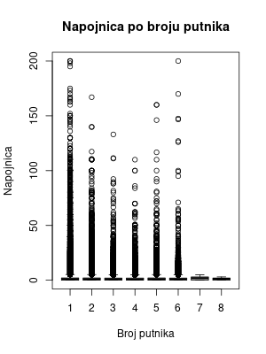
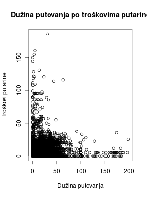
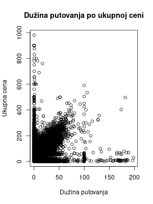
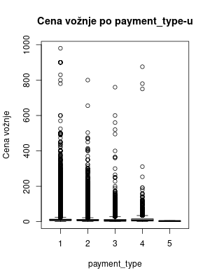
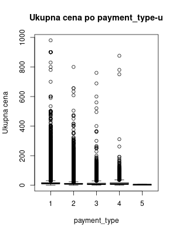
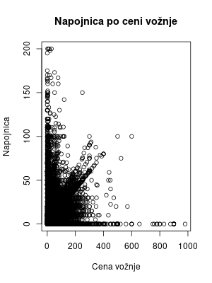

### Luka Ćirić, E2 18/2023
# Specifikacija
Specifikacija na [linku](http://www.acs.uns.ac.rs/sr/filebrowser/download/11975528)

# Opis skupa podataka
Skup podataka je javno dostupan za preuzimanje na [linku](https://www.nyc.gov/site/tlc/about/tlc-trip-record-data.page). 
Podaci originalno preuzeti u **PARQUET** formatu, a zatim konvertovani u **CSV** format.
Skup podataka se sastoji od podataka o kretanju taksi vozila i zaradi u Njujorku u januaru 2015. godine.

## Opis atributa
Skup podataka se sastoji od atributa:<br/>
1. **VendorID** - identifikator provajdera usluge taksi prevoza<br/>
2. **tpep_pickup_datetime** - datum i vreme preuzimanja putnika<br/>
3. **tpep_dropoff_datetime** - datum i vreme iskrcavanja putnika<br/>
4. **passenger_count** - broj putnika<br/>
5. **trip_distance** - dužina putovanja u miljama<br/>
6. **RatecodeID** - identifikator tarifnog koda<br/>
7. **store_and_fwd_flag** - indikator da li je vožnja prvo sačuvana u memoriji pre slanja<br/>
8. **PULocationID** - identifikator lokacije preuzimanja putnika<br/>
9. **DOLocationID** - identifikator lokacije iskrcavanja putnika<br/>
10. **payment_type** - način plaćanja<br/>
12. **fare_amount** - cena vožnje<br/>
13. **extra** - dodatni troškovi<br/>
14. **mta_tax** - troškovi MTA<br/>
15. **tip_amount** - napojnica (popunjena samo za plaćanje karticom)<br/>
16. **tolls_amount** - troškovi putarine<br/>
17. **improvement_surcharge** - troškovi poboljšanja<br/>
18. **total_amount** - ukupna cena<br/>
19. **congestion_surcharge** - troškovi gužve<br/>
20. **airport_fee** - troškovi aerodroma<br/>

Specifikacija obeležja dostupna na [linku](https://www.nyc.gov/assets/tlc/downloads/pdf/data_dictionary_trip_records_yellow.pdf)

## Kod za prevođenje podataka u CSV format (Python):
```python
import pandas as pd

def parquet_to_csv(parquet_file_path, csv_file_path):
    # Read the Parquet file into a DataFrame
    df = pd.read_parquet(parquet_file_path)
    
    # Write the DataFrame to a CSV file
    df.to_csv(csv_file_path, index=False)

if __name__ == "__main__":
    # Replace these with your actual file paths
    parquet_file_path = input("Enter input file: ") + ".parquet"
    csv_file_path = input("Enter output file: ") + ".csv"
    
    parquet_to_csv(parquet_file_path, csv_file_path)
    
```

# Implementacija
## Instalacija
### Instalacija paketa
```{r Instalacija paketa, results='hide', message=FALSE, warning=FALSE, error=FALSE}
install.packages("tidyverse")
install.packages("sparklyr")
install.packages("rmarkdown")
install.packages("knitr")
install.packages("pandoc")
install.packages("dbplot")
```
### Učitavanje paketa
```{r Učitavanje paketa, results='hide', message=FALSE, warning=FALSE, error=FALSE}
library(sparklyr)
library(dplyr)
library(knitr)
library(rmarkdown)
library(ggplot2)
library(dbplot)
library(pandoc)
spark_install()
knitr::opts_knit$set(root.dir = file.path(getwd()))
```
### Podešavanje Spark sesije
```{r Podešavanje Spark sesije i knitr, results='hide', message=FALSE, warning=FALSE, error=FALSE}
conf <- spark_config()
conf["spark.executor.memory"] <- "6G"
conf["sparklyr.shell.driver-memory"] <- "6G"
sc <- spark_connect(master = "local", config = conf)
```
## Podaci
### Učitavanje skupa podataka
```{r Učitavanje skupa podataka, results='hide', message=FALSE, warning=FALSE, error=FALSE}
ds.path <- "~/FAX/RVPUII/projekat/data"
ds.df <- spark_read_csv(sc, name = "my_data", path = ds.path, header = TRUE, infer_schema = TRUE, memory = TRUE)
```
### Filtriranje skupa podataka
```{r Filtriranje skupa podataka, results='hide', message=FALSE, warning=FALSE, error=FALSE}
ds.filtered <- ds.df %>% 
    select(VendorID, passenger_count, trip_distance, RatecodeID, payment_type, fare_amount, extra, mta_tax, tip_amount, tolls_amount, improvement_surcharge, total_amount) %>%
    filter(
      !(is.na(VendorID) || is.na(passenger_count) || is.na(trip_distance) || is.na(RatecodeID) ||
        is.na(payment_type) || is.na(fare_amount) || is.na(improvement_surcharge) || is.na(total_amount)) ||
        is.na(extra) || is.na(mta_tax) || is.na(tip_amount) || is.na(tolls_amount)
    ) %>%
    filter(
        RatecodeID >= 1 && RatecodeID <= 6 &&
        trip_distance >= 0 && trip_distance <= 200 && 
        fare_amount >= 0 && fare_amount <= 200 &&
        extra >= 0 && extra <= 1 &&
        mta_tax >= 0 && mta_tax <= 1 &&
        tip_amount >= 0 && tip_amount <= 200 &&
        tolls_amount >= 0 && tolls_amount <= 200 && 
        improvement_surcharge >= 0 && improvement_surcharge <= 200 &&
        total_amount >= 0 && total_amount <= 300 &&
        payment_type >= 1 && payment_type <= 6
    )
```

### Dodavanje novih atributa
```{r Dodavanje novih atributa, results='hide', message=FALSE, warning=FALSE, error=FALSE}
data <- ds.filtered %>% 
    mutate(paid_with_card = ifelse(payment_type == 1, T, F))
```
### Funkcija za čišćenje memorije
```{r Funkcija za čišćenje memorije, results='hide', message=FALSE, warning=FALSE, error=FALSE}
clearFn <- function() {
    all_objects <- ls()
    needed_to_keep <- c("sc", "ds.df", "ds.filtered", "data", "conf", "clearFn")
    to_remove <- setdiff(all_objects, needed_to_keep)
    rm(list = to_remove)
}
```
## Analiza pojedinačnih atributa
### Analiza atributa VendorID
```{r Analiza atributa VendorID, message=FALSE, warning=FALSE, error=FALSE}
vendorIdCounts <- data %>%
    group_by(VendorID) %>% 
    summarise(count = n()) %>% 
    collect() %>% arrange(VendorID)

kable(vendorIdCounts)
```

```{r Vizuelizacija atributa VendorID, include=FALSE, eval=FALSE, message=FALSE, warning=FALSE, error=FALSE}
vds <- pull(data, VendorID)
png("images/vendorIdCounts.png", width = 800, height = 1200)
pi <- pie(table(vds), main = "Broj vožnji po VendorID-u", labels = c("VendorID 1", "VendorID 2"))
dev.off()

clearFn()
```


### Analiza atributa passenger_count
```{r Analiza atributa passenger_count, message=FALSE, warning=FALSE, error=FALSE}
passengerCountCounts <- data %>%
    group_by(passenger_count) %>% 
    summarise(count = n()) %>% 
    collect() %>% arrange(passenger_count)

kable(passengerCountCounts)
```
```{r Vizuelizacija atributa passenger_count, include=FALSE, eval=FALSE, message=FALSE, warning=FALSE, error=FALSE}
passengerCounts <- pull(data, passenger_count)

png("images/passengerCountHistogram.png", width = 800, height = 1200)
xgran <- pretty(passengerCounts, n = 10)
xlabel <- seq(1, 8, 1)
hst <- hist(passengerCounts, main = "Broj vožnji po broju putnika", xlab = "Broj putnika", ylab = "Broj vožnji")
axis(1, at = xlabel, labels = xlabel)
ygran <- pretty(hst$counts, n = 10)
ylabel <- replace(ygran, ygran %% 1000000 != 0, NA)
axis(2, at = ygran, labels = ylabel)
dev.off()
clearFn()
```


### Analiza atributa trip_distance
```{r Analiza atributa trip_distance, message=FALSE, warning=FALSE, error=FALSE}
tripDistanceCounts <- data %>%
    summarise(min = min(trip_distance), max = max(trip_distance), avg = mean(trip_distance), median = median(trip_distance)) %>%
    collect()


kable(tripDistanceCounts)
```
```{r Vizuelizacija atributa trip_distance, include=FALSE, eval=FALSE, message=FALSE, warning=FALSE, error=FALSE}
tripDistances <- pull(data, trip_distance)
png("images/tripDistanceDensity.png", width = 800, height = 1200)
plt <- plot(density(tripDistances), main = "Distribucija atributa trip_distance", xlab = "Dužina putovanja", ylab = "Gustina")
dev.off()
clearFn()
```


### Analiza atributa RatecodeID
```{r Analiza atributa RatecodeID, message=FALSE, warning=FALSE, error=FALSE}
ratecodeIdCounts <- data %>%
    group_by(RatecodeID) %>% 
    summarise(count = n()) %>% 
    collect() %>% arrange(RatecodeID)


kable(ratecodeIdCounts)
```
```{r Vizuelizacija atributa RatecodeID, include=FALSE, eval=FALSE, message=FALSE, warning=FALSE, error=FALSE}
bar <- ggplot(ratecodeIdCounts, aes(x = RatecodeID, y = count, fill = RatecodeID)) +
    geom_bar(stat = "identity") +
    labs(title = "Broj vožnji po RatecodeID-u", x = "RatecodeID", y = "Broj vožnji") +
    scale_y_continuous(breaks = seq(0, 20000000, 1000000)) +
    scale_x_continuous(breaks = seq(0, 6, 1), limits = c(0, 6))

ggsave("images/ratecodeIdCounts.png", bar)
clearFn()
```


### Analiza atributa payment_type
```{r Analiza atributa payment_type, message=FALSE, warning=FALSE, error=FALSE}
paymentTypeCounts <- data %>%
    group_by(payment_type) %>% 
    summarise(count = n()) %>% 
    collect() %>% arrange(payment_type)


kable(paymentTypeCounts)
```
```{r Vizuelizacija atributa payment_type, include=FALSE, eval=FALSE, message=FALSE, warning=FALSE, error=FALSE}
bar <- ggplot(paymentTypeCounts, aes(x = payment_type, y = count, fill = payment_type)) +
    geom_bar(stat = "identity") +
    labs(title = "Broj vožnji po payment_type-u", x = "payment_type", y = "Broj vožnji") +
    scale_y_continuous(breaks = seq(0, 20000000, 1000000)) +
    scale_x_continuous(breaks = seq(1, 6, 1), limits = c(0, 6))

ggsave("images/paymentTypeCounts.png", bar)
clearFn()
```


### Analiza atributa fare_amount
```{r Analiza atributa fare_amount, message=FALSE, warning=FALSE, error=FALSE}
fareAmountCounts <- data %>%
    summarise(min = min(fare_amount), max = max(fare_amount), avg = mean(fare_amount), median = median(fare_amount)) %>%
    collect()


kable(fareAmountCounts)
```
```{r Vizuelizacija atributa fare_amount, include=FALSE, eval=FALSE, message=FALSE, warning=FALSE, error=FALSE}
fareAmounts <- pull(data, fare_amount)
png("images/fareAmountDensity.png", width = 800, height = 1200)

plt <- plot(density(fareAmounts), main = "Distribucija atributa fare_amount", xlab = "Cena vožnje", ylab = "Gustina", xlim = c(0, 100))

dev.off()
clearFn()
```


### Analiza atributa extra
```{r Analiza atributa extra, message=FALSE, warning=FALSE, error=FALSE}
extraCounts <- data %>%
    group_by(extra) %>%
    summarise(count = n()) %>%
    collect() %>% arrange(extra)


kable(extraCounts)
```
```{r Vizuelizacija atributa extra, include=FALSE, eval=FALSE, message=FALSE, warning=FALSE, error=FALSE}
extraValues <- pull(data, extra)
bar <- ggplot(extraCounts, aes(x = extra, y = count, fill = extra)) +
    geom_bar(stat = "identity", width = 0.4) +
    labs(title = "Broj vožnji po extra", x = "extra", y = "Broj vožnji") +
    scale_y_continuous(breaks = seq(0, 5000000, 1000000), limits=c(0, 5000000)) + 
    scale_x_continuous(breaks = seq(0, 1, 0.5), limits=c(0, 1.5))

ggsave("images/extraCounts.png", bar)
clearFn()
```


### Analiza atributa mta_tax
```{r Analiza atributa mta_tax, message=FALSE, warning=FALSE, error=FALSE}
mtaTaxCounts <- data %>%
    group_by(mta_tax) %>%
    summarise(count = n()) %>%
    collect() %>% arrange(mta_tax)


kable(mtaTaxCounts)
```
```{r Vizuelizacija atributa mta_tax, include=FALSE, eval=FALSE, message=FALSE, warning=FALSE, error=FALSE}
mtaTaxValues <- pull(data, mta_tax)
bar <- ggplot(mtaTaxCounts, aes(x = mta_tax, y = count, fill = mta_tax)) +
    geom_bar(stat = "identity", width = 0.4) +
    labs(title = "Broj vožnji po mta_tax", x = "mta_tax", y = "Broj vožnji") +
    scale_y_continuous(breaks = seq(0, 13000000, 1000000), limits=c(0, 13000000)) + 
    scale_x_continuous(breaks = seq(-1, 1, 0.5), limits=c(-1, 1))

ggsave("images/mtaTaxCounts.png", bar)
clearFn()
```


### Analiza atributa tip_amount
```{r Analiza atributa tip_amount, message=FALSE, warning=FALSE, error=FALSE}
tipAmountCounts <- data %>%
    summarise(min = min(tip_amount), max = max(tip_amount), avg = mean(tip_amount), median = median(tip_amount)) %>%
    collect()


kable(tipAmountCounts)
```
```{r Vizuelizacija atributa tip_amount, include=FALSE, eval=FALSE, message=FALSE, warning=FALSE, error=FALSE}
tipAmounts <- pull(data, tip_amount)
png("images/tipAmountDensity.png", width = 800, height = 1200)
plt <- plot(density(tipAmounts), main = "Distribucija atributa tip_amount", xlab = "Napojnica", ylab = "Gustina", xlim = c(0, 20))
dev.off()
clearFn()
```


### Analiza atributa tolls_amount
```{r Analiza atributa tolls_amount, message=FALSE, warning=FALSE, error=FALSE}
tollsAmountCounts <- data %>%
    summarise(min = min(tolls_amount), max = max(tolls_amount), avg = mean(tolls_amount), median = median(tolls_amount)) %>%
    collect()


kable(tollsAmountCounts)
```
```{r Vizuelizacija atributa tolls_amount, include=FALSE, eval=FALSE, message=FALSE, warning=FALSE, error=FALSE}
tollsAmounts <- pull(data, tolls_amount)
png("images/tollsAmountDensity.png", width = 800, height = 1200)
plt <- plot(density(tollsAmounts), main = "Distribucija atributa tolls_amount", xlab = "Troškovi putarine", ylab = "Gustina",  xlim = c(0, 20))
dev.off()
clearFn()
```


### Analiza atributa improvement_surcharge
```{r Analiza atributa improvement_surcharge, message=FALSE, warning=FALSE, error=FALSE}
improvementSurchargeCounts <- data %>%
    summarise(min = min(improvement_surcharge), max = max(improvement_surcharge), avg = mean(improvement_surcharge), median = median(improvement_surcharge)) %>%
    collect()

kable(improvementSurchargeCounts)
```
```{r Vizuelizacija atributa improvement_surcharge, include=FALSE, eval=FALSE, message=FALSE, warning=FALSE, error=FALSE}
improvementSurcharge <- pull(data, improvement_surcharge)
png("images/improvementSurchargeDensity.png", width = 800, height = 1200)
plt <- plot(density(improvementSurcharge), main = "Distribucija atributa improvement_surcharge", xlab = "Troškovi poboljšanja", ylab = "Gustina", xlim = c(0, 0.4))
dev.off()
clearFn()
```


### Analiza atributa total_amount
```{r Analiza atributa total_amount, message=FALSE, warning=FALSE, error=FALSE}
totalAmountCounts <- data %>%
    summarise(min = min(total_amount), max = max(total_amount), avg = mean(total_amount), median = median(total_amount)) %>%
    collect()

kable(totalAmountCounts)
```
```{r Vizuelizacija atributa total_amount, include=FALSE, eval=FALSE, message=FALSE, warning=FALSE, error=FALSE}
totalAmount <- pull(data, total_amount)
png("images/totalAmountDensity.png", width = 800, height = 1200)
plt <- plot(density(totalAmount), main = "Distribucija atributa total_amount", xlab = "Ukupna cena", ylab = "Gustina", xlim = c(0, 300))
dev.off()
clearFn()
```


### Analiza atributa paid_with_card
```{r Analiza atributa paid_with_card, message=FALSE, warning=FALSE, error=FALSE}
paidWithCardCounts <- data %>%
    group_by(paid_with_card) %>%
    summarise(count = n()) %>%
    collect()

kable(paidWithCardCounts)
```
```{r Vizuelizacija atributa paid_with_card, include=FALSE, eval=FALSE, message=FALSE, warning=FALSE, error=FALSE}
py <- pull(data, paid_with_card)
png("images/paidWithCardCounts.png", width = 800, height = 1200)
pi <- pie(table(py), main = "Broj vožnji po načinu plaćanja", labels = c("Plaćeno karticom", "Nije plaćeno karticom"))
dev.off()
clearFn()
```


## Analiza zavisnosti atributa
### Analiza zavisnosti atributa VendorID i passenger_count
```{r Analiza zavisnosti atributa VendorID i passenger_count, message=FALSE, warning=FALSE, error=FALSE}
vendorIdPassengerCount <- data %>%
    group_by(VendorID, passenger_count) %>%
    summarise(count = n()) %>%
    arrange(VendorID, passenger_count) %>%
    collect() 

kable(vendorIdPassengerCount)
```
```{r Vizuelizacija zavisnosti atributa VendorID i passenger_count, include=FALSE, eval=FALSE, message=FALSE, warning=FALSE, error=FALSE}
vxp <- data %>%
    select(VendorID, passenger_count) %>%
    collect()

png("images/vendorIdPassengerCount.png", width = 800, height = 1200)
boxplot(passenger_count ~ VendorID, data = vxp, main = "Broj vožnji po VendorID-u i broju putnika", xlab = "VendorID", ylab = "Broj putnika")
dev.off()
clearFn()
```


### Analiza zavisnosti atributa VendorID i trip_distance
```{r Analiza zavisnosti atributa VendorID i trip_distance, message=FALSE, warning=FALSE, error=FALSE}
vendorIdTripDistance <- data %>%
    group_by(VendorID) %>%
    summarise(min = min(trip_distance), max = max(trip_distance), avg = mean(trip_distance), median = median(trip_distance)) %>%
    arrange(VendorID) %>%
    collect()

kable(vendorIdTripDistance)
```
```{r Vizuelizacija zavisnosti atributa VendorID i trip_distance, include=FALSE, eval=FALSE, message=FALSE, warning=FALSE, error=FALSE}
vtd <- data %>%
    select(VendorID, trip_distance) %>%
    collect()

png("images/vendorIdTripDistance.png", width = 800, height = 1200)
boxplot(trip_distance ~ VendorID, data = vtd, main = "Dužina putovanja po VendorID-u", xlab = "VendorID", ylab = "Dužina putovanja")
dev.off()
clearFn()
```


### Analiza zavisnosti atributa VendorID i RatecodeID
```{r Analiza zavisnosti atributa VendorID i RatecodeID, message=FALSE, warning=FALSE, error=FALSE}
vendorIdRatecodeId <- data %>%
    group_by(VendorID, RatecodeID) %>%
    summarise(count = n()) %>%
    arrange(VendorID, RatecodeID) %>%
    collect()

kable(vendorIdRatecodeId)
```
```{r Vizuelizacija zavisnosti atributa VendorID i RatecodeID, include=FALSE, eval=FALSE, message=FALSE, warning=FALSE, error=FALSE}
vri <- data %>%
    select(VendorID, RatecodeID) %>%
    collect()

png("images/vendorIdRatecodeId.png", width = 800, height = 1200)
mosaicplot(table(vri), main = "Broj vožnji po VendorID-u i RatecodeID-u", xlab = "VendorID", ylab = "RatecodeID", color = c("red", "blue", "green", "yellow", "purple", "orange"))
dev.off()
clearFn()
```


### Analiza zavisnosti atributa VendorID i payment_type
```{r Analiza zavisnosti atributa VendorID i payment_type, message=FALSE, warning=FALSE, error=FALSE}
vendorIdPaymentType <- data %>%
    group_by(VendorID, payment_type) %>%
    summarise(count = n()) %>%
    collect() %>% arrange(VendorID, payment_type)

kable(vendorIdPaymentType)
```
```{r Vizuelizacija zavisnosti atributa VendorID i payment_type, include=FALSE, eval=FALSE, message=FALSE, warning=FALSE, error=FALSE}
vpt <- data %>%
    select(VendorID, payment_type) %>%
    collect()

png("images/vendorIdPaymentType.png", width = 800, height = 1200)
barplot(table(vpt), beside = T, main = "Broj vožnji po VendorID-u i payment_type-u", xlab = "VendorID", ylab = "Broj vožnji", col = c("red", "blue", "green", "yellow", "purple", "orange"), legend = rownames(table(vpt)))
dev.off()
clearFn()
```


### Analiza zavisnosti atributa VendorID i fare_amount
```{r Analiza zavisnosti atributa VendorID i fare_amount, message=FALSE, warning=FALSE, error=FALSE}
vendorIdFareAmount <- data %>%
    group_by(VendorID) %>%
    summarise(min = min(fare_amount), max = max(fare_amount), avg = mean(fare_amount), median = median(fare_amount)) %>%
    collect()

kable(vendorIdFareAmount)
```
```{r Vizuelizacija zavisnosti atributa VendorID i fare_amount, include=FALSE, eval=FALSE, message=FALSE, warning=FALSE, error=FALSE}
vfa <- data %>%
    select(VendorID, fare_amount) %>%
    collect()

png("images/vendorIdFareAmount.png", width = 800, height = 1200)
boxplot(fare_amount ~ VendorID, data = vfa, main = "Cena vožnje po VendorID-u", xlab = "VendorID", ylab = "Cena vožnje")
dev.off()
clearFn()
```


### Analiza zavisnosti atributa VendorID i extra
```{r Analiza zavisnosti atributa VendorID i extra, message=FALSE, warning=FALSE, error=FALSE}
vendorIdExtra <- data %>%
    group_by(VendorID) %>%
    summarise(min = min(extra), max = max(extra), avg = mean(extra), median = median(extra)) %>%
    collect()

kable(vendorIdExtra)
```
```{r Vizuelizacija zavisnosti atributa VendorID i extra, include=FALSE, eval=FALSE, message=FALSE, warning=FALSE, error=FALSE}
vex <- data %>%
    select(VendorID, extra) %>%
    collect()

png("images/vendorIdExtra.png", width = 800, height = 1200)
barplot(table(vex), beside = T, main = "Broj vožnji po VendorID-u i extra", 
    xlab = "VendorID", ylab = "Broj vožnji", col = c("red", "blue"), 
    legend = rownames(table(vex)),)
dev.off()
clearFn()
```


### Analiza zavisnosti atributa VendorID i mta_tax
```{r Analiza zavisnosti atributa VendorID i mta_tax, message=FALSE, warning=FALSE, error=FALSE}
vendorIdMtaTax <- data %>%
    group_by(VendorID, mta_tax) %>%
    summarise(count = n()) %>%
    collect()

kable(vendorIdMtaTax)
```
```{r Vizuelizacija zavisnosti atributa VendorID i mta_tax, include=FALSE, eval=FALSE, message=FALSE, warning=FALSE, error=FALSE}
vmt <- data %>%
    select(VendorID, mta_tax) %>%
    collect()

png("images/vendorIdMtaTax.png", width = 800, height = 1200)
mosaicplot(table(vmt), main = "Broj vožnji po VendorID-u i mta_tax", xlab = "VendorID", ylab = "mta_tax", color = c("red", "blue", "green", "yellow", "purple", "orange"))
dev.off()
clearFn()
```


### Analiza zavisnosti atributa VendorID i tip_amount
```{r Analiza zavisnosti atributa VendorID i tip_amount, message=FALSE, warning=FALSE, error=FALSE}
vendorIdTipAmount <- data %>%
    group_by(VendorID) %>%
    summarise(min = min(tip_amount), max = max(tip_amount), avg = mean(tip_amount), median = median(tip_amount)) %>%
    collect()

kable(vendorIdTipAmount)
```
```{r Vizuelizacija zavisnosti atributa VendorID i tip_amount, include=FALSE, eval=FALSE, message=FALSE, warning=FALSE, error=FALSE}
vta <- data %>%
    select(VendorID, tip_amount) %>%
    collect()

png("images/vendorIdTipAmount.png", width = 800, height = 1200)
boxplot(tip_amount ~ VendorID, data = vta, main = "Napojnica po VendorID-u", xlab = "VendorID", ylab = "Napojnica")
dev.off()
clearFn()
```


### Analiza zavisnosti atributa VendorID i tolls_amount
```{r Analiza zavisnosti atributa VendorID i tolls_amount, message=FALSE, warning=FALSE, error=FALSE}
vendorIdTollsAmount <- data %>%
    group_by(VendorID) %>%
    summarise(min = min(tolls_amount), max = max(tolls_amount), avg = mean(tolls_amount), median = median(tolls_amount)) %>%
    collect()

kable(vendorIdTollsAmount)
```
```{r Vizuelizacija zavisnosti atributa VendorID i tolls_amount, include=FALSE, eval=FALSE, message=FALSE, warning=FALSE, error=FALSE}
vta <- data %>%
    select(VendorID, tolls_amount) %>%
    collect()

png("images/vendorIdTollsAmount.png", width = 800, height = 1200)
boxplot(tolls_amount ~ VendorID, data = vta, main = "Troškovi putarine po VendorID-u", xlab = "VendorID", ylab = "Troškovi putarine")
dev.off()
clearFn()
```


### Analiza zavisnosti atributa VendorID i improvement_surcharge
```{r Analiza zavisnosti atributa VendorID i improvement_surcharge, message=FALSE, warning=FALSE, error=FALSE}
vendorIdImprovementSurcharge <- data %>%
    group_by(VendorID, improvement_surcharge) %>%
     summarise(count = n()) %>%
    collect()
```
```{r Vizuelizacija zavisnosti atributa VendorID i improvement_surcharge, include=FALSE, eval=FALSE, message=FALSE, warning=FALSE, error=FALSE}
vis <- data %>%
    select(VendorID, improvement_surcharge) %>%
    collect()

png("images/vendorIdImprovementSurcharge.png", width = 800, height = 1200)
mosaicplot(table(vis), main = "Broj vožnji po VendorID-u i improvement_surcharge", xlab = "VendorID", ylab = "improvement_surcharge", color = c("red", "blue", "green", "yellow", "purple", "orange"))
dev.off()
clearFn()
```


### Analiza zavisnosti atributa VendorID i total_amount
```{r Analiza zavisnosti atributa VendorID i total_amount, message=FALSE, warning=FALSE, error=FALSE}
vendorIdTotalAmount <- data %>%
    group_by(VendorID) %>%
    summarise(min = min(total_amount), max = max(total_amount), avg = mean(total_amount), median = median(total_amount)) %>%
    collect()

kable(vendorIdTotalAmount)
```
```{r Vizuelizacija zavisnosti atributa VendorID i total_amount, include=FALSE, eval=FALSE, message=FALSE, warning=FALSE, error=FALSE}
vta <- data %>%
    select(VendorID, total_amount) %>%
    collect()

png("images/vendorIdTotalAmount.png", width = 800, height = 1200)
boxplot(total_amount ~ VendorID, data = vta, main = "Ukupna cena po VendorID-u", xlab = "VendorID", ylab = "Ukupna cena")
dev.off()    
clearFn()
```


### Analiza zavisnosti atributa VendorID i paid_with_card
```{r Analiza zavisnosti atributa VendorID i paid_with_card, message=FALSE, warning=FALSE, error=FALSE}
vendorIdPaidWithCard <- data %>%
    group_by(VendorID, paid_with_card) %>%
    summarise(count = n()) %>%
    collect()

kable(vendorIdPaidWithCard)
```
```{r Vizuelizacija zavisnosti atributa VendorID i paid_with_card, include=FALSE, eval=FALSE, message=FALSE, warning=FALSE, error=FALSE}
vpc <- data %>%
    select(VendorID, paid_with_card) %>%
    collect()

png("images/vendorIdPaidWithCard.png", width = 800, height = 1200)
mosaicplot(table(vpc), main = "Broj vožnji po VendorID-u i načinu plaćanja", xlab = "VendorID", ylab = "paid_with_card", color = c("red", "blue"))
dev.off()
clearFn()
```


### Analiza zavisnosti atributa passenger_count i trip_distance
```{r Analiza zavisnosti atributa passenger_count i trip_distance, message=FALSE, warning=FALSE, error=FALSE}
passengerCountTripDistance <- data %>%
    group_by(passenger_count) %>%
    summarise(min = min(trip_distance), max = max(trip_distance), avg = mean(trip_distance), median = median(trip_distance)) %>%
    collect()

kable(passengerCountTripDistance)
```
```{r Vizuelizacija zavisnosti atributa passenger_count i trip_distance, include=FALSE, eval=FALSE, message=FALSE, warning=FALSE, error=FALSE}
ptd <- data %>%
    select(passenger_count, trip_distance) %>%
    collect()

png("images/passengerCountTripDistance.png", width = 800, height = 1200)
boxplot(trip_distance ~ passenger_count, data = ptd, main = "Dužina putovanja po broju putnika", xlab = "Broj putnika", ylab = "Dužina putovanja")
dev.off()
clearFn()
```


### Analiza zavisnosti atributa passenger_count i RatecodeID
```{r Analiza zavisnosti atributa passenger_count i RatecodeID, message=FALSE, warning=FALSE, error=FALSE}
passengerCountRatecodeId <- data %>%
    group_by(passenger_count, RatecodeID) %>%
    summarise(count = n()) %>%
    collect() %>% arrange(passenger_count, RatecodeID)

kable(passengerCountRatecodeId)
```
```{r Vizuelizacija zavisnosti atributa passenger_count i RatecodeID, include=FALSE, eval=FALSE, message=FALSE, warning=FALSE, error=FALSE}
pr <- data %>%
    select(passenger_count, RatecodeID) %>%
    collect()

png("images/passengerCountRatecodeId.png", width = 800, height = 1200)
mosaicplot(table(pr), main = "Broj vožnji po broju putnika i RatecodeID-u", xlab = "Broj putnika", ylab = "RatecodeID", color = c("red", "blue", "green", "yellow", "purple", "orange"))
dev.off()
clearFn()
```

### Analiza zavisnosti atributa passenger_count i payment_type
```{r Analiza zavisnosti atributa passenger_count i payment_type, message=FALSE, warning=FALSE, error=FALSE}
passengerCountPaymentType <- data %>%
    group_by(passenger_count, payment_type) %>%
    summarise(count = n()) %>%
    collect() %>% arrange(passenger_count, payment_type)

kable(passengerCountPaymentType)
```
```{r Vizuelizacija zavisnosti atributa passenger_count i payment_type, include=FALSE, eval=FALSE, message=FALSE, warning=FALSE, error=FALSE}
ppt <- data %>%
    select(passenger_count, payment_type) %>%
    collect()

png("images/passengerCountPaymentType.png", width = 800, height = 1200)
mosaicplot(table(ppt), main = "Broj vožnji po broju putnika i payment_type-u", xlab = "Broj putnika", ylab = "payment_type", color = c("red", "blue", "green", "yellow", "purple", "orange"))
dev.off()
clearFn()
```


### Analiza zavisnosti atributa passenger_count i fare_amount
```{r Analiza zavisnosti atributa passenger_count i fare_amount, message=FALSE, warning=FALSE, error=FALSE}
passengerCountFareAmount <- data %>%
    group_by(passenger_count) %>%
    summarise(min = min(fare_amount), max = max(fare_amount), avg = mean(fare_amount), median = median(fare_amount)) %>%
    collect()

kable(passengerCountFareAmount)
```
```{r Vizuelizacija zavisnosti atributa passenger_count i fare_amount, include=FALSE, eval=FALSE, message=FALSE, warning=FALSE, error=FALSE}
pfa <- data %>%
    select(passenger_count, fare_amount) %>%
    collect()

png("images/passengerCountFareAmount.png", width = 800, height = 1200)
boxplot(fare_amount ~ passenger_count, data = pfa, main = "Cena vožnje po broju putnika", xlab = "Broj putnika", ylab = "Cena vožnje")
dev.off()
clearFn()
```


### Analiza zavisnosti atributa passenger_count i extra
```{r Analiza zavisnosti atributa passenger_count i extra, message=FALSE, warning=FALSE, error=FALSE}
passengerCountExtra <- data %>%
    group_by(passenger_count, extra) %>%
    summarise(count = n()) %>%
    collect()

kable(passengerCountExtra)
```
```{r Vizuelizacija zavisnosti atributa passenger_count i extra, include=FALSE, eval=FALSE, message=FALSE, warning=FALSE, error=FALSE}
pex <- data %>%
    select(passenger_count, extra) %>%
    collect()

png("images/passengerCountExtra.png", width = 800, height = 1200)
mosaicplot(table(pex), main = "Broj vožnji po broju putnika i extra", xlab = "Broj putnika", ylab = "extra", color = c("red", "blue"))
dev.off()
clearFn()
```


### Analiza zavisnosti atributa passenger_count i mta_tax
```{r Analiza zavisnosti atributa passenger_count i mta_tax, message=FALSE, warning=FALSE, error=FALSE}
passengerCountMtaTax <- data %>%
    group_by(passenger_count, mta_tax) %>%
    summarise(count = n()) %>%
    collect()

kable(passengerCountMtaTax)
```
```{r Vizuelizacija zavisnosti atributa passenger_count i mta_tax, include=FALSE, eval=FALSE, message=FALSE, warning=FALSE, error=FALSE}
pmt <- data %>%
    select(passenger_count, mta_tax) %>%
    collect()

png("images/passengerCountMtaTax.png", width = 800, height = 1200)
mosaicplot(table(pmt), main = "Broj vožnji po broju putnika i mta_tax", xlab = "Broj putnika", ylab = "mta_tax", color = c("red", "blue", "green", "yellow", "purple", "orange"))
dev.off()
clearFn()
```


### Analiza zavisnosti atributa passenger_count i tip_amount
```{r Analiza zavisnosti atributa passenger_count i tip_amount, message=FALSE, warning=FALSE, error=FALSE}
passengerCountTipAmount <- data %>%
    group_by(passenger_count) %>%
    summarise(min = min(tip_amount), max = max(tip_amount), avg = mean(tip_amount), median = median(tip_amount)) %>%
    collect()
    
kable(passengerCountTipAmount)
```
```{r Vizuelizacija zavisnosti atributa passenger_count i tip_amount, include=FALSE, eval=FALSE, message=FALSE, warning=FALSE, error=FALSE}
pta <- data %>%
    select(passenger_count, tip_amount) %>%
    collect()

png("images/passengerCountTipAmount.png", width = 800, height = 1200)
boxplot(tip_amount ~ passenger_count, data = pta, main = "Napojnica po broju putnika", xlab = "Broj putnika", ylab = "Napojnica")
dev.off()
clearFn()
```


### Analiza zavisnosti atributa passenger_count i tolls_amount
```{r Analiza zavisnosti atributa passenger_count i tolls_amount, message=FALSE, warning=FALSE, error=FALSE}
passengerCountTollsAmount <- data %>%
    group_by(passenger_count) %>%
    summarise(min = min(tolls_amount), max = max(tolls_amount), avg = mean(tolls_amount), median = median(tolls_amount)) %>%
    collect()

kable(passengerCountTollsAmount)
```
```{r Vizuelizacija zavisnosti atributa passenger_count i tolls_amount, include=FALSE, eval=FALSE, message=FALSE, warning=FALSE, error=FALSE}
pta <- data %>%
    select(passenger_count, tolls_amount) %>%
    collect()

png("images/passengerCountTollsAmount.png", width = 800, height = 1200)
boxplot(tolls_amount ~ passenger_count, data = pta, main = "Troškovi putarine po broju putnika", xlab = "Broj putnika", ylab = "Troškovi putarine")
dev.off()
clearFn()
```


### Analiza zavisnosti atributa passenger_count i improvement_surcharge
```{r Analiza zavisnosti atributa passenger_count i improvement_surcharge, message=FALSE, warning=FALSE, error=FALSE}
passengerCountImprovementSurcharge <- data %>%
    group_by(passenger_count, improvement_surcharge) %>%
    summarise(count = n()) %>%
    collect()
    
kable(passengerCountImprovementSurcharge)
```
```{r Vizuelizacija zavisnosti atributa passenger_count i improvement_surcharge, include=FALSE, eval=FALSE, message=FALSE, warning=FALSE, error=FALSE}
pis <- data %>%
    select(passenger_count, improvement_surcharge) %>%
    collect()

png("images/passengerCountImprovementSurcharge.png", width = 800, height = 1200)
mosaicplot(table(pis), main = "Broj vožnji po broju putnika i improvement_surcharge", xlab = "Broj putnika", ylab = "improvement_surcharge", color = c("red", "blue", "green", "yellow", "purple", "orange"))
dev.off()
clearFn()
```


### Analiza zavisnosti atributa passenger_count i total_amount
```{r Analiza zavisnosti atributa passenger_count i total_amount, message=FALSE, warning=FALSE, error=FALSE}
passengerCountTotalAmount <- data %>%
    group_by(passenger_count) %>%
    summarise(min = min(total_amount), max = max(total_amount), avg = mean(total_amount), median = median(total_amount)) %>%
    collect()

kable(passengerCountTotalAmount)
```
```{r Vizuelizacija zavisnosti atributa passenger_count i total_amount, include=FALSE, eval=FALSE, message=FALSE, warning=FALSE, error=FALSE}
pta <- data %>%
    select(passenger_count, total_amount) %>%
    collect()

png("images/passengerCountTotalAmount.png", width = 800, height = 1200)
boxplot(total_amount ~ passenger_count, data = pta, main = "Ukupna cena po broju putnika", xlab = "Broj putnika", ylab = "Ukupna cena")
dev.off()
clearFn()
```


### Analiza zavisnosti atributa passenger_count i paid_with_card
```{r Analiza zavisnosti atributa passenger_count i paid_with_card, message=FALSE, warning=FALSE, error=FALSE}
passengerCountPaidWithCard <- data %>%
    group_by(passenger_count, paid_with_card) %>%
    summarise(count = n()) %>%
    collect()

kable(passengerCountPaidWithCard)
```
```{r Vizuelizacija zavisnosti atributa passenger_count i paid_with_card, include=FALSE, eval=FALSE, message=FALSE, warning=FALSE, error=FALSE}
ppc <- data %>%
    select(passenger_count, paid_with_card) %>%
    collect()

png("images/passengerCountPaidWithCard.png", width = 800, height = 1200)
mosaicplot(table(ppc), main = "Broj vožnji po broju putnika i načinu plaćanja", xlab = "Broj putnika", ylab = "paid_with_card", color = c("red", "blue"))
dev.off()
clearFn()
```


### Analiza zavisnosti atributa trip_distance i RatecodeID
```{r Analiza zavisnosti atributa trip_distance i RatecodeID, message=FALSE, warning=FALSE, error=FALSE}
tripDistanceRatecodeId <- data %>%
    group_by(RatecodeID) %>%
    summarise(min = min(trip_distance), max = max(trip_distance), avg = mean(trip_distance), median = median(trip_distance)) %>%
    collect()

kable(tripDistanceRatecodeId)
```
```{r Vizuelizacija zavisnosti atributa trip_distance i RatecodeID, include=FALSE, eval=FALSE, message=FALSE, warning=FALSE, error=FALSE}
tr <- data %>%
    select(trip_distance, RatecodeID) %>%
    collect()

png("images/tripDistanceRatecodeId.png", width = 800, height = 1200)
boxplot(trip_distance ~ RatecodeID, data = tr, main = "Dužina putovanja po RatecodeID-u", xlab = "RatecodeID", ylab = "Dužina putovanja")
dev.off()
clearFn()
```


### Analiza zavisnosti atributa trip_distance i payment_type
```{r Analiza zavisnosti atributa trip_distance i payment_type, message=FALSE, warning=FALSE, error=FALSE}
tripDistancePaymentType <- data %>%
    group_by(payment_type) %>%
    summarise(min = min(trip_distance), max = max(trip_distance), avg = mean(trip_distance), median = median(trip_distance)) %>%
    collect()
```
```{r Vizuelizacija zavisnosti atributa trip_distance i payment_type, include=FALSE, eval=FALSE, message=FALSE, warning=FALSE, error=FALSE}
tp <- data %>%
    select(trip_distance, payment_type) %>%
    collect()

png("images/tripDistancePaymentType.png", width = 800, height = 1200)
boxplot(trip_distance ~ payment_type, data = tp, main = "Dužina putovanja po payment_type-u", xlab = "payment_type", ylab = "Dužina putovanja")
dev.off()
```

### Analiza zavisnosti atributa trip_distance i fare_amount
```{r Vizuelizacija zavisnosti atributa trip_distance i fare_amount, include=FALSE, eval=FALSE, message=FALSE, warning=FALSE, error=FALSE}
tfa <- data %>%
    select(trip_distance, fare_amount) %>%
    collect()

png("images/tripDistanceFareAmount.png", width = 800, height = 1200)
plot(tfa, main = "Dužina putovanja po ceni vožnje", xlab = "Dužina putovanja", ylab = "Cena vožnje")
dev.off()
clearFn()
```


### Analiza zavisnosti atributa trip_distance i extra
```{r Analiza zavisnosti atributa trip_distance i extra, message=FALSE, warning=FALSE, error=FALSE}
tripDistanceExtra <- data %>%
    group_by(extra) %>%
    summarise(min = min(trip_distance), max = max(trip_distance), avg = mean(trip_distance), median = median(trip_distance)) %>%
    collect()

kable(tripDistanceExtra)
```
```{r Vizuelizacija zavisnosti atributa trip_distance i extra, include=FALSE, eval=FALSE, message=FALSE, warning=FALSE, error=FALSE}
te <- data %>%
    select(trip_distance, extra) %>%
    collect()

png("images/tripDistanceExtra.png", width = 800, height = 1200)
boxplot(trip_distance ~ extra, data = te, main = "Dužina putovanja po extra", xlab = "extra", ylab = "Dužina putovanja")
dev.off()
clearFn()
```


### Analiza zavisnosti atributa trip_distance i mta_tax
```{r Analiza zavisnosti atributa trip_distance i mta_tax, message=FALSE, warning=FALSE, error=FALSE}
tripDistanceMtaTax <- data %>%
    group_by(mta_tax) %>%
    summarise(min = min(trip_distance), max = max(trip_distance), avg = mean(trip_distance), median = median(trip_distance)) %>%
    collect()

kable(tripDistanceMtaTax)
```
```{r Vizuelizacija zavisnosti atributa trip_distance i mta_tax, include=FALSE, eval=FALSE, message=FALSE, warning=FALSE, error=FALSE}
tmt <- data %>%
    select(trip_distance, mta_tax) %>%
    collect()

png("images/tripDistanceMtaTax.png", width = 800, height = 1200)
boxplot(trip_distance ~ mta_tax, data = tmt, main = "Dužina putovanja po mta_tax", xlab = "mta_tax", ylab = "Dužina putovanja")
dev.off()
clearFn()
```


### Analiza zavisnosti atributa trip_distance i tip_amount
```{r Vizuelizacija zavisnosti atributa trip_distance i tip_amount, include=FALSE, eval=FALSE, message=FALSE, warning=FALSE, error=FALSE}
tta <- data %>%
    select(trip_distance, tip_amount) %>%
    collect()

png("images/tripDistanceTipAmount.png", width = 800, height = 1200)
plot(tta, main = "Dužina putovanja po napojnici", xlab = "Dužina putovanja", ylab = "Napojnica")
dev.off()
clearFn()
```


### Analiza zavisnosti atributa trip_distance i tolls_amount
```{r Vizuelizacija zavisnosti atributa trip_distance i tolls_amount, include=FALSE, eval=FALSE, message=FALSE, warning=FALSE, error=FALSE}
tta <- data %>%
    select(trip_distance, tolls_amount) %>%
    collect()

png("images/tripDistanceTollsAmount.png", width = 800, height = 1200)
plot(tta, main = "Dužina putovanja po troškovima putarine", xlab = "Dužina putovanja", ylab = "Troškovi putarine")
dev.off()
clearFn()
```


### Analiza zavisnosti atributa trip_distance i improvement_surcharge
```{r Analiza zavisnosti atributa trip_distance i improvement_surcharge, message=FALSE, warning=FALSE, error=FALSE}
tripDistanceImprovementSurcharge <- data %>%
    group_by(improvement_surcharge) %>%
    summarise(min = min(trip_distance), max = max(trip_distance), avg = mean(trip_distance), median = median(trip_distance)) %>%
    collect()

kable(tripDistanceImprovementSurcharge)
```
```{r Vizuelizacija zavisnosti atributa trip_distance i improvement_surcharge, include=FALSE, eval=FALSE, message=FALSE, warning=FALSE, error=FALSE}
tis <- data %>%
    select(trip_distance, improvement_surcharge) %>%
    collect()

png("images/tripDistanceImprovementSurcharge.png", width = 800, height = 1200)
boxplot(trip_distance ~ improvement_surcharge, data = tis, main = "Dužina putovanja po improvement_surcharge", xlab = "improvement_surcharge", ylab = "Dužina putovanja")
dev.off()
clearFn()
```


### Analiza zavisnosti atributa trip_distance i total_amount
```{r Vizuelizacija zavisnosti atributa trip_distance i total_amount, include=FALSE, eval=FALSE, message=FALSE, warning=FALSE, error=FALSE}
tta <- data %>%
    select(trip_distance, total_amount) %>%
    collect()

png("images/tripDistanceTotalAmount.png", width = 800, height = 1200)
plot(tta, main = "Dužina putovanja po ukupnoj ceni", xlab = "Dužina putovanja", ylab = "Ukupna cena")
dev.off()
clearFn()
```


### Analiza zavisnosti atributa trip_distance i paid_with_card
```{r Analiza zavisnosti atributa trip_distance i paid_with_card, message=FALSE, warning=FALSE, error=FALSE}
tripDistancePaidWithCard <- data %>%
    group_by(paid_with_card) %>%
    summarise(min = min(trip_distance), max = max(trip_distance), avg = mean(trip_distance), median = median(trip_distance)) %>%
    collect()

kable(tripDistancePaidWithCard)
```
```{r Vizuelizacija zavisnosti atributa trip_distance i paid_with_card, include=FALSE, eval=FALSE, message=FALSE, warning=FALSE, error=FALSE}
tpc <- data %>%
    select(trip_distance, paid_with_card) %>%
    collect()

png("images/tripDistancePaidWithCard.png", width = 800, height = 1200)
boxplot(trip_distance ~ paid_with_card, data = tpc, main = "Dužina putovanja po načinu plaćanja", xlab = "Način plaćanja", ylab = "Dužina putovanja")
dev.off()
clearFn()
```


### Analiza zavisnosti atributa RatecodeID i payment_type
```{r Analiza zavisnosti atributa RatecodeID i payment_type, message=FALSE, warning=FALSE, error=FALSE}
ratecodeIdPaymentType <- data %>%
    group_by(RatecodeID, payment_type) %>%
    summarise(count = n()) %>%
    collect() %>% arrange(RatecodeID, payment_type)

kable(ratecodeIdPaymentType)
```
```{r Vizuelizacija zavisnosti atributa RatecodeID i payment_type, include=FALSE, eval=FALSE, message=FALSE, warning=FALSE, error=FALSE}
rpt <- data %>%
    select(RatecodeID, payment_type) %>%
    collect()

png("images/ratecodeIdPaymentType.png", width = 800, height = 1200)
mosaicplot(table(rpt), main = "Broj vožnji po RatecodeID-u i payment_type-u", xlab = "RatecodeID", ylab = "payment_type", color = c("red", "blue", "green", "yellow", "purple", "orange"))
dev.off()
clearFn()
```


### Analiza zavisnosti atributa RatecodeID i fare_amount
```{r Analiza zavisnosti atributa RatecodeID i fare_amount, message=FALSE, warning=FALSE, error=FALSE}
ratecodeIdFareAmount <- data %>%
    group_by(RatecodeID) %>%
    summarise(min = min(fare_amount), max = max(fare_amount), avg = mean(fare_amount), median = median(fare_amount)) %>%
    collect()

kable(ratecodeIdFareAmount)
```
```{r Vizuelizacija zavisnosti atributa RatecodeID i fare_amount, include=FALSE, eval=FALSE, message=FALSE, warning=FALSE, error=FALSE}
rfa <- data %>%
    select(RatecodeID, fare_amount) %>%
    collect()

png("images/ratecodeIdFareAmount.png", width = 800, height = 1200)
boxplot(fare_amount ~ RatecodeID, data = rfa, main = "Cena vožnje po RatecodeID-u", xlab = "RatecodeID", ylab = "Cena vožnje")
dev.off()
clearFn()
```


### Analiza zavisnosti atributa RatecodeID i extra
```{r Analiza zavisnosti atributa RatecodeID i extra, message=FALSE, warning=FALSE, error=FALSE}
ratecodeIdExtra <- data %>%
    group_by(RatecodeID, extra) %>%
    summarise(count = n()) %>%
    collect()

kable(ratecodeIdExtra)
```
```{r Vizuelizacija zavisnosti atributa RatecodeID i extra, include=FALSE, eval=FALSE, message=FALSE, warning=FALSE, error=FALSE}
rex <- data %>%
    select(RatecodeID, extra) %>%
    collect()

png("images/ratecodeIdExtra.png", width = 800, height = 1200)
mosaicplot(table(rex), main = "Broj vožnji po RatecodeID-u i extra", xlab = "RatecodeID", ylab = "extra", color = c("red", "blue"))
dev.off()
clearFn()
```


### Analiza zavisnosti atributa RatecodeID i mta_tax
```{r Analiza zavisnosti atributa RatecodeID i mta_tax, message=FALSE, warning=FALSE, error=FALSE}
ratecodeIdMtaTax <- data %>%
    group_by(RatecodeID, mta_tax) %>%
    summarise(count = n()) %>%
    collect()

kable(ratecodeIdMtaTax)
```
```{r Vizuelizacija zavisnosti atributa RatecodeID i mta_tax, include=FALSE, eval=FALSE, message=FALSE, warning=FALSE, error=FALSE}
rmt <- data %>%
    select(RatecodeID, mta_tax) %>%
    collect()

png("images/ratecodeIdMtaTax.png", width = 800, height = 1200)
mosaicplot(table(rmt), main = "Broj vožnji po RatecodeID-u i mta_tax", xlab = "RatecodeID", ylab = "mta_tax", color = c("red", "blue", "green", "yellow", "purple", "orange"))
dev.off()
clearFn()
```


### Analiza zavisnosti atributa RatecodeID i tip_amount
```{r Analiza zavisnosti atributa RatecodeID i tip_amount, message=FALSE, warning=FALSE, error=FALSE}
ratecodeIdTipAmount <- data %>%
    group_by(RatecodeID) %>%
    summarise(min = min(tip_amount), max = max(tip_amount), avg = mean(tip_amount), median = median(tip_amount)) %>%
    collect()

kable(ratecodeIdTipAmount)
```
```{r Vizuelizacija zavisnosti atributa RatecodeID i tip_amount, include=FALSE, eval=FALSE, message=FALSE, warning=FALSE, error=FALSE}
rta <- data %>%
    select(RatecodeID, tip_amount) %>%
    collect()

png("images/ratecodeIdTipAmount.png", width = 800, height = 1200)
boxplot(tip_amount ~ RatecodeID, data = rta, main = "Napojnica po RatecodeID-u", xlab = "RatecodeID", ylab = "Napojnica")
dev.off()
clearFn()
```


### Analiza zavisnosti atributa RatecodeID i tolls_amount
```{r Analiza zavisnosti atributa RatecodeID i tolls_amount, message=FALSE, warning=FALSE, error=FALSE}
ratecodeIdTollsAmount <- data %>%
    group_by(RatecodeID) %>%
    summarise(min = min(tolls_amount), max = max(tolls_amount), avg = mean(tolls_amount), median = median(tolls_amount)) %>%
    collect()

kable(ratecodeIdTollsAmount)
```
```{r Vizuelizacija zavisnosti atributa RatecodeID i tolls_amount, include=FALSE, eval=FALSE, message=FALSE, warning=FALSE, error=FALSE}
rta <- data %>%
    select(RatecodeID, tolls_amount) %>%
    collect()

png("images/ratecodeIdTollsAmount.png", width = 800, height = 1200)
boxplot(tolls_amount ~ RatecodeID, data = rta, main = "Troškovi putarine po RatecodeID-u", xlab = "RatecodeID", ylab = "Troškovi putarine")
dev.off()
clearFn()
```


### Analiza zavisnosti atributa RatecodeID i improvement_surcharge
```{r Analiza zavisnosti atributa RatecodeID i improvement_surcharge, message=FALSE, warning=FALSE, error=FALSE}
ratecodeIdImprovementSurcharge <- data %>%
    group_by(RatecodeID, improvement_surcharge) %>%
    summarise(count = n()) %>%
    collect()

kable(ratecodeIdImprovementSurcharge)
```
```{r Vizuelizacija zavisnosti atributa RatecodeID i improvement_surcharge, include=FALSE, eval=FALSE, message=FALSE, warning=FALSE, error=FALSE}
ris <- data %>%
    select(RatecodeID, improvement_surcharge) %>%
    collect()

png("images/ratecodeIdImprovementSurcharge.png", width = 800, height = 1200)
mosaicplot(table(ris), main = "Broj vožnji po RatecodeID-u i improvement_surcharge", xlab = "RatecodeID", ylab = "improvement_surcharge", color = c("red", "blue", "green", "yellow", "purple", "orange"))
dev.off()
clearFn()
```


### Analiza zavisnosti atributa RatecodeID i total_amount
```{r Analiza zavisnosti atributa RatecodeID i total_amount, message=FALSE, warning=FALSE, error=FALSE}
ratecodeIdTotalAmount <- data %>%
    group_by(RatecodeID) %>%
    summarise(min = min(total_amount), max = max(total_amount), avg = mean(total_amount), median = median(total_amount)) %>%
    collect()

kable(ratecodeIdTotalAmount)
```
```{r Vizuelizacija zavisnosti atributa RatecodeID i total_amount, include=FALSE, eval=FALSE, message=FALSE, warning=FALSE, error=FALSE}
rta <- data %>%
    select(RatecodeID, total_amount) %>%
    collect()

png("images/ratecodeIdTotalAmount.png", width = 800, height = 1200)
boxplot(total_amount ~ RatecodeID, data = rta, main = "Ukupna cena po RatecodeID-u", xlab = "RatecodeID", ylab = "Ukupna cena")
dev.off()
clearFn()
```


### Analiza zavisnosti atributa RatecodeID i paid_with_card
```{r Analiza zavisnosti atributa RatecodeID i paid_with_card, message=FALSE, warning=FALSE, error=FALSE}
ratecodeIdPaidWithCard <- data %>%
    group_by(RatecodeID, paid_with_card) %>%
    summarise(count = n()) %>%
    collect()

kable(ratecodeIdPaidWithCard)
```
```{r Vizuelizacija zavisnosti atributa RatecodeID i paid_with_card, include=FALSE, eval=FALSE, message=FALSE, warning=FALSE, error=FALSE}
rpc <- data %>%
    select(RatecodeID, paid_with_card) %>%
    collect()

png("images/ratecodeIdPaidWithCard.png", width = 800, height = 1200)
mosaicplot(table(rpc), main = "Broj vožnji po RatecodeID-u i načinu plaćanja", xlab = "RatecodeID", ylab = "paid_with_card", color = c("red", "blue"))
dev.off()
clearFn()
```


### Analiza zavisnosti atributa payment_type i fare_amount
```{r Analiza zavisnosti atributa payment_type i fare_amount, message=FALSE, warning=FALSE, error=FALSE}
paymentTypeFareAmount <- data %>%
    group_by(payment_type) %>%
    summarise(min = min(fare_amount), max = max(fare_amount), avg = mean(fare_amount), median = median(fare_amount)) %>%
    collect()

kable(paymentTypeFareAmount)
```
```{r Vizuelizacija zavisnosti atributa payment_type i fare_amount, include=FALSE, eval=FALSE, message=FALSE, warning=FALSE, error=FALSE}
pfa <- data %>%
    select(payment_type, fare_amount) %>%
    collect()

png("images/paymentTypeFareAmount.png", width = 800, height = 1200)
boxplot(fare_amount ~ payment_type, data = pfa, main = "Cena vožnje po payment_type-u", xlab = "payment_type", ylab = "Cena vožnje")
dev.off()
clearFn()
```


### Analiza zavisnosti atributa payment_type i extra
```{r Analiza zavisnosti atributa payment_type i extra, message=FALSE, warning=FALSE, error=FALSE}
paymentTypeExtra <- data %>%
    group_by(payment_type, extra) %>%
    summarise(count = n()) %>%
    collect()

kable(paymentTypeExtra)
```
```{r Vizuelizacija zavisnosti atributa payment_type i extra, include=FALSE, eval=FALSE, message=FALSE, warning=FALSE, error=FALSE}
pex <- data %>%
    select(payment_type, extra) %>%
    collect()

png("images/paymentTypeExtra.png", width = 800, height = 1200)
mosaicplot(table(pex), main = "Broj vožnji po payment_type-u i extra", xlab = "payment_type", ylab = "extra", color = c("red", "blue"))
dev.off()
clearFn()
```


### Analiza zavisnosti atributa payment_type i mta_tax
```{r Analiza zavisnosti atributa payment_type i mta_tax, message=FALSE, warning=FALSE, error=FALSE}
paymentTypeMtaTax <- data %>%
    group_by(payment_type, mta_tax) %>%
    summarise(count = n()) %>%
    collect()

kable(paymentTypeMtaTax)
```
```{r Vizuelizacija zavisnosti atributa payment_type i mta_tax, include=FALSE, eval=FALSE, message=FALSE, warning=FALSE, error=FALSE}
pmt <- data %>%
    select(payment_type, mta_tax) %>%
    collect()

png("images/paymentTypeMtaTax.png", width = 800, height = 1200)
mosaicplot(table(pmt), main = "Broj vožnji po payment_type-u i mta_tax", xlab = "payment_type", ylab = "mta_tax", color = c("red", "blue", "green", "yellow", "purple", "orange"))
dev.off()
clearFn()
```


### Analiza zavisnosti atributa payment_type i tip_amount
```{r Analiza zavisnosti atributa payment_type i tip_amount, message=FALSE, warning=FALSE, error=FALSE}
paymentTypeTipAmount <- data %>%
    group_by(payment_type) %>%
    summarise(min = min(tip_amount), max = max(tip_amount), avg = mean(tip_amount), median = median(tip_amount)) %>%
    collect()

kable(paymentTypeTipAmount)
```
```{r Vizuelizacija zavisnosti atributa payment_type i tip_amount, include=FALSE, eval=FALSE, message=FALSE, warning=FALSE, error=FALSE}
pta <- data %>%
    select(payment_type, tip_amount) %>%
    collect()

png("images/paymentTypeTipAmount.png", width = 800, height = 1200)
boxplot(tip_amount ~ payment_type, data = pta, main = "Napojnica po payment_type-u", xlab = "payment_type", ylab = "Napojnica")
dev.off()
```

### Analiza zavisnosti atributa payment_type i tolls_amount
```{r Analiza zavisnosti atributa payment_type i tolls_amount, message=FALSE, warning=FALSE, error=FALSE}
paymentTypeTollsAmount <- data %>%
    group_by(payment_type) %>%
    summarise(min = min(tolls_amount), max = max(tolls_amount), avg = mean(tolls_amount), median = median(tolls_amount)) %>%
    collect()

kable(paymentTypeTollsAmount)
```
```{r Vizuelizacija zavisnosti atributa payment_type i tolls_amount, include=FALSE, eval=FALSE, message=FALSE, warning=FALSE, error=FALSE}
pta <- data %>%
    select(payment_type, tolls_amount) %>%
    collect()

png("images/paymentTypeTollsAmount.png", width = 800, height = 1200)
boxplot(tolls_amount ~ payment_type, data = pta, main = "Troškovi putarine po payment_type-u", xlab = "payment_type", ylab = "Troškovi putarine")
dev.off()
```

### Analiza zavisnosti atributa payment_type i improvement_surcharge
```{r Analiza zavisnosti atributa payment_type i improvement_surcharge, message=FALSE, warning=FALSE, error=FALSE}
paymentTypeImprovementSurcharge <- data %>%
    group_by(payment_type, improvement_surcharge) %>%
    summarise(count = n()) %>%
    collect()

kable(paymentTypeImprovementSurcharge)
```
```{r Vizuelizacija zavisnosti atributa payment_type i improvement_surcharge, include=FALSE, eval=FALSE, message=FALSE, warning=FALSE, error=FALSE}
pis <- data %>%
    select(payment_type, improvement_surcharge) %>%
    collect()

png("images/paymentTypeImprovementSurcharge.png", width = 800, height = 1200)
mosaicplot(table(pis), main = "Broj vožnji po payment_type-u i improvement_surcharge", xlab = "payment_type", ylab = "improvement_surcharge", color = c("red", "blue", "green", "yellow", "purple", "orange"))
dev.off()
clearFn()
```


### Analiza zavisnosti atributa payment_type i total_amount
```{r Analiza zavisnosti atributa payment_type i total_amount, message=FALSE, warning=FALSE, error=FALSE}
paymentTypeTotalAmount <- data %>%
    group_by(payment_type) %>%
    summarise(min = min(total_amount), max = max(total_amount), avg = mean(total_amount), median = median(total_amount)) %>%
    collect()

kable(paymentTypeTotalAmount)
```
```{r Vizuelizacija zavisnosti atributa payment_type i total_amount, include=FALSE, eval=FALSE, message=FALSE, warning=FALSE, error=FALSE}
pta <- data %>%
    select(payment_type, total_amount) %>%
    collect()

png("images/paymentTypeTotalAmount.png", width = 800, height = 1200)
boxplot(total_amount ~ payment_type, data = pta, main = "Ukupna cena po payment_type-u", xlab = "payment_type", ylab = "Ukupna cena")
dev.off()
clearFn()
```


### Analiza zavisnosti atributa payment_type i paid_with_card
```{r Analiza zavisnosti atributa payment_type i paid_with_card, message=FALSE, warning=FALSE, error=FALSE}
paymentTypePaidWithCard <- data %>%
    group_by(payment_type, paid_with_card) %>%
    summarise(count = n()) %>%
    collect()

kable(paymentTypePaidWithCard)
```
```{r Vizuelizacija zavisnosti atributa payment_type i paid_with_card, include=FALSE, eval=FALSE, message=FALSE, warning=FALSE, error=FALSE}
ppc <- data %>%
    select(payment_type, paid_with_card) %>%
    collect()

png("images/paymentTypePaidWithCard.png", width = 800, height = 1200)
mosaicplot(table(ppc), main = "Broj vožnji po payment_type-u i načinu plaćanja", xlab = "payment_type", ylab = "paid_with_card", color = c("red", "blue"))
dev.off()
clearFn()
```


### Analiza zavisnosti atributa fare_amount i extra
```{r Analiza zavisnosti atributa fare_amount i extra, message=FALSE, warning=FALSE, error=FALSE}
fareAmountExtra <- data %>%
    group_by(extra) %>%
    summarise(min = min(fare_amount), max = max(fare_amount), avg = mean(fare_amount), median = median(fare_amount)) %>%
    collect()

kable(fareAmountExtra)
```
```{r Vizuelizacija zavisnosti atributa fare_amount i extra, include=FALSE, eval=FALSE, message=FALSE, warning=FALSE, error=FALSE}
fae <- data %>%
    select(fare_amount, extra) %>%
    collect()

png("images/fareAmountExtra.png", width = 800, height = 1200)
boxplot(fare_amount ~ extra, data = fae, main = "Cena vožnje po extra", xlab = "extra", ylab = "Cena vožnje")
dev.off()
clearFn()
```


### Analiza zavisnosti atributa fare_amount i mta_tax
```{r Analiza zavisnosti atributa fare_amount i mta_tax, message=FALSE, warning=FALSE, error=FALSE}
fareAmountMtaTax <- data %>%
    group_by(mta_tax) %>%
    summarise(min = min(fare_amount), max = max(fare_amount), avg = mean(fare_amount), median = median(fare_amount)) %>%
    collect()
    
kable(fareAmountMtaTax)
```
```{r Vizuelizacija zavisnosti atributa fare_amount i mta_tax, include=FALSE, eval=FALSE, message=FALSE, warning=FALSE, error=FALSE}
fmt <- data %>%
    select(fare_amount, mta_tax) %>%
    collect()

png("images/fareAmountMtaTax.png", width = 800, height = 1200)
mosaicplot(table(fmt), main = "Broj vožnji po ceni vožnje i mta_tax", xlab = "fare_amount", ylab = "mta_tax", color = c("red", "blue", "green", "yellow", "purple", "orange"))
dev.off()
clearFn()
```


### Analiza zavisnosti atributa fare_amount i tip_amount
```{r Vizuelizacija zavisnosti atributa fare_amount i tip_amount, include=FALSE, eval=FALSE, message=FALSE, warning=FALSE, error=FALSE}
fta <- data %>%
    select(fare_amount, tip_amount) %>%
    collect()

png("images/fareAmountTipAmount.png", width = 800, height = 1200)
plot(tip_amount ~ fare_amount, data = fta, main = "Napojnica po ceni vožnje", xlab = "Cena vožnje", ylab = "Napojnica")
dev.off()
clearFn()
```


### Analiza zavisnosti atributa fare_amount i tolls_amount
```{r Vizuelizacija zavisnosti atributa fare_amount i tolls_amount, include=FALSE, eval=FALSE, message=FALSE, warning=FALSE, error=FALSE}
fta <- data %>%
    select(fare_amount, tolls_amount) %>%
    collect()

png("images/fareAmountTollsAmount.png", width = 800, height = 1200)
plot(tolls_amount ~ fare_amount, data = fta, main = "Troškovi putarine po ceni vožnje", xlab = "Cena vožnje", ylab = "Troškovi putarine")
dev.off()
clearFn()
```


### Analiza zavisnosti atributa fare_amount i improvement_surcharge
```{r Analiza zavisnosti atributa fare_amount i improvement_surcharge, message=FALSE, warning=FALSE, error=FALSE}
fareAmountImprovementSurcharge <- data %>%
    group_by(improvement_surcharge) %>%
    summarise(min = min(fare_amount), max = max(fare_amount), avg = mean(fare_amount), median = median(fare_amount)) %>%
    collect()

kable(fareAmountImprovementSurcharge)
```
```{r Vizuelizacija zavisnosti atributa fare_amount i improvement_surcharge, include=FALSE, eval=FALSE, message=FALSE, warning=FALSE, error=FALSE}
fis <- data %>%
    select(fare_amount, improvement_surcharge) %>%
    collect()

png("images/fareAmountImprovementSurcharge.png", width = 800, height = 1200)
mosaicplot(table(fis), main = "Broj vožnji po ceni vožnje i improvement_surcharge", xlab = "fare_amount", ylab = "improvement_surcharge", color = c("red", "blue", "green", "yellow", "purple", "orange"))
dev.off()
clearFn()
```


### Analiza zavisnosti atributa fare_amount i total_amount
```{r Vizuelizacija zavisnosti atributa fare_amount i total_amount, include=FALSE, eval=FALSE, message=FALSE, warning=FALSE, error=FALSE}
fta <- data %>%
    select(fare_amount, total_amount) %>%
    collect()

png("images/fareAmountTotalAmount.png", width = 800, height = 1200)
plot(total_amount ~ fare_amount, data = fta, main = "Ukupna cena po ceni vožnje", xlab = "Cena vožnje", ylab = "Ukupna cena")
dev.off()
clearFn()
```


### Analiza zavisnosti atributa fare_amount i paid_with_card
```{r Analiza zavisnosti atributa fare_amount i paid_with_card, message=FALSE, warning=FALSE, error=FALSE}
fareAmountPaidWithCard <- data %>%
    group_by(paid_with_card) %>%
    summarise(min = min(fare_amount), max = max(fare_amount), avg = mean(fare_amount), median = median(fare_amount)) %>%
    collect()

kable(fareAmountPaidWithCard)
```
```{r Vizuelizacija zavisnosti atributa fare_amount i paid_with_card, include=FALSE, eval=FALSE, message=FALSE, warning=FALSE, error=FALSE}
fpc <- data %>%
    select(fare_amount, paid_with_card) %>%
    collect()

png("images/fareAmountPaidWithCard.png", width = 800, height = 1200)
mosaicplot(table(fpc), main = "Broj vožnji po ceni vožnje i načinu plaćanja", xlab = "fare_amount", ylab = "paid_with_card", color = c("red", "blue"))
dev.off()
clearFn()
```


### Analiza zavisnosti atributa extra i mta_tax
```{r Analiza zavisnosti atributa extra i mta_tax, message=FALSE, warning=FALSE, error=FALSE}
extraMtaTax <- data %>%
    group_by(mta_tax, extra) %>%
    summarise(count = n()) %>%
    collect()

kable(extraMtaTax)
```
```{r Vizuelizacija zavisnosti atributa extra i mta_tax, include=FALSE, eval=FALSE, message=FALSE, warning=FALSE, error=FALSE}
emt <- data %>%
    select(extra, mta_tax) %>%
    collect()

png("images/extraMtaTax.png", width = 800, height = 1200)
mosaicplot(table(emt), main = "Broj vožnji po extra i mta_tax", xlab = "extra", ylab = "mta_tax", color = c("red", "blue", "green", "yellow", "purple", "orange"))
dev.off()
clearFn()
```


### Analiza zavisnosti atributa extra i tip_amount
```{r Analiza zavisnosti atributa extra i tip_amount, message=FALSE, warning=FALSE, error=FALSE}
extraTipAmount <- data %>%
    group_by(extra) %>%
    summarise(min = min(tip_amount), max = max(tip_amount), avg = mean(tip_amount), median = median(tip_amount)) %>%
    collect()

kable(extraTipAmount)
```
```{r Vizuelizacija zavisnosti atributa extra i tip_amount, include=FALSE, eval=FALSE, message=FALSE, warning=FALSE, error=FALSE}
eta <- data %>%
    select(extra, tip_amount) %>%
    collect()

png("images/extraTipAmount.png", width = 800, height = 1200)
boxplot(tip_amount ~ extra, data = eta, main = "Napojnica po extra", xlab = "extra", ylab = "Napojnica")
dev.off()
clearFn()
```


### Analiza zavisnosti atributa extra i tolls_amount
```{r Analiza zavisnosti atributa extra i tolls_amount, message=FALSE, warning=FALSE, error=FALSE}
extraTollsAmount <- data %>%
    group_by(extra) %>%
    summarise(min = min(tolls_amount), max = max(tolls_amount), avg = mean(tolls_amount), median = median(tolls_amount)) %>%
    collect()

kable(extraTollsAmount)
```
```{r Vizuelizacija zavisnosti atributa extra i tolls_amount, include=FALSE, eval=FALSE, message=FALSE, warning=FALSE, error=FALSE}
eta <- data %>%
    select(extra, tolls_amount) %>%
    collect()

png("images/extraTollsAmount.png", width = 800, height = 1200)
boxplot(tolls_amount ~ extra, data = eta, main = "Troškovi putarine po extra", xlab = "extra", ylab = "Troškovi putarine")
dev.off()
clearFn()
```


### Analiza zavisnosti atributa extra i improvement_surcharge
```{r Analiza zavisnosti atributa extra i improvement_surcharge, message=FALSE, warning=FALSE, error=FALSE}
extraImprovementSurcharge <- data %>%
    group_by(extra, improvement_surcharge) %>%
    summarise(count = n()) %>%
    collect()

kable(extraImprovementSurcharge)
```
```{r Vizuelizacija zavisnosti atributa extra i improvement_surcharge, include=FALSE, eval=FALSE, message=FALSE, warning=FALSE, error=FALSE}
eis <- data %>%
    select(extra, improvement_surcharge) %>%
    collect()

png("images/extraImprovementSurcharge.png", width = 800, height = 1200)
mosaicplot(table(eis), main = "Broj vožnji po extra i improvement_surcharge", xlab = "extra", ylab = "improvement_surcharge", color = c("red", "blue", "green", "yellow", "purple", "orange"))
dev.off()
clearFn()
```


### Analiza zavisnosti atributa extra i total_amount
```{r Analiza zavisnosti atributa extra i total_amount, message=FALSE, warning=FALSE, error=FALSE}
extraTotalAmount <- data %>%
    group_by(extra) %>%
    summarise(min = min(total_amount), max = max(total_amount), avg = mean(total_amount), median = median(total_amount)) %>%
    collect()

kable(extraTotalAmount)
```
```{r Vizuelizacija zavisnosti atributa extra i total_amount, include=FALSE, eval=FALSE, message=FALSE, warning=FALSE, error=FALSE}
eta <- data %>%
    select(extra, total_amount) %>%
    collect()

png("images/extraTotalAmount.png", width = 800, height = 1200)
boxplot(total_amount ~ extra, data = eta, main = "Ukupna cena po extra", xlab = "extra", ylab = "Ukupna cena")
dev.off()
clearFn()
```


### Analiza zavisnosti atributa extra i paid_with_card
```{r Analiza zavisnosti atributa extra i paid_with_card, message=FALSE, warning=FALSE, error=FALSE}
extraPaidWithCard <- data %>%
    group_by(extra, paid_with_card) %>%
    summarise(count = n()) %>%
    collect()

kable(extraPaidWithCard)
```
```{r Vizuelizacija zavisnosti atributa extra i paid_with_card, include=FALSE, eval=FALSE, message=FALSE, warning=FALSE, error=FALSE}
epc <- data %>%
    select(extra, paid_with_card) %>%
    collect()

png("images/extraPaidWithCard.png", width = 800, height = 1200)
mosaicplot(table(epc), main = "Broj vožnji po extra i načinu plaćanja", xlab = "extra", ylab = "paid_with_card", color = c("red", "blue"))
dev.off()
clearFn()
```


### Analiza zavisnosti atributa mta_tax i tip_amount
```{r Analiza zavisnosti atributa mta_tax i tip_amount, message=FALSE, warning=FALSE, error=FALSE}
mtaTaxTipAmount <- data %>%
    group_by(mta_tax) %>%
    summarise(min = min(tip_amount), max = max(tip_amount), avg = mean(tip_amount), median = median(tip_amount)) %>%
    collect()

kable(mtaTaxTipAmount)
```
```{r Vizuelizacija zavisnosti atributa mta_tax i tip_amount, include=FALSE, eval=FALSE, message=FALSE, warning=FALSE, error=FALSE}
mta <- data %>%
    select(mta_tax, tip_amount) %>%
    collect()

png("images/mtaTaxTipAmount.png", width = 800, height = 1200)
boxplot(tip_amount ~ mta_tax, data = mta, main = "Napojnica po mta_tax-u", xlab = "mta_tax", ylab = "Napojnica")
dev.off()
clearFn()
```


### Analiza zavisnosti atributa mta_tax i tolls_amount
```{r Analiza zavisnosti atributa mta_tax i tolls_amount, message=FALSE, warning=FALSE, error=FALSE}
mtaTaxTollsAmount <- data %>%
    group_by(mta_tax) %>%
    summarise(min = min(tolls_amount), max = max(tolls_amount), avg = mean(tolls_amount), median = median(tolls_amount)) %>%
    collect()

kable(mtaTaxTollsAmount)
```
```{r Vizuelizacija zavisnosti atributa mta_tax i tolls_amount, include=FALSE, eval=FALSE, message=FALSE, warning=FALSE, error=FALSE}
mta <- data %>%
    select(mta_tax, tolls_amount) %>%
    collect()

png("images/mtaTaxTollsAmount.png", width = 800, height = 1200)
boxplot(tolls_amount ~ mta_tax, data = mta, main = "Troškovi putarine po mta_tax-u", xlab = "mta_tax", ylab = "Troškovi putarine")
dev.off()
clearFn()
```


### Analiza zavisnosti atributa mta_tax i improvement_surcharge
```{r Analiza zavisnosti atributa mta_tax i improvement_surcharge, message=FALSE, warning=FALSE, error=FALSE}
mtaTaxImprovementSurcharge <- data %>%
    group_by(mta_tax, improvement_surcharge) %>%
    summarise(count = n()) %>%
    collect()

kable(mtaTaxImprovementSurcharge)
```
```{r Vizuelizacija zavisnosti atributa mta_tax i improvement_surcharge, include=FALSE, eval=FALSE, message=FALSE, warning=FALSE, error=FALSE}
mis <- data %>%
    select(mta_tax, improvement_surcharge) %>%
    collect()

png("images/mtaTaxImprovementSurcharge.png", width = 800, height = 1200)
mosaicplot(table(mis), main = "Broj vožnji po mta_tax-u i improvement_surcharge", xlab = "mta_tax", ylab = "improvement_surcharge", color = c("red", "blue", "green", "yellow", "purple", "orange"))
dev.off()
clearFn()
```


### Analiza zavisnosti atributa mta_tax i total_amount
```{r Analiza zavisnosti atributa mta_tax i total_amount, message=FALSE, warning=FALSE, error=FALSE}
mtaTaxTotalAmount <- data %>%
    group_by(mta_tax) %>%
    summarise(min = min(total_amount), max = max(total_amount), avg = mean(total_amount), median = median(total_amount)) %>%
    collect()

kable(mtaTaxTotalAmount)
```
```{r Vizuelizacija zavisnosti atributa mta_tax i total_amount, include=FALSE, eval=FALSE, message=FALSE, warning=FALSE, error=FALSE}
mta <- data %>%
    select(mta_tax, total_amount) %>%
    collect()

png("images/mtaTaxTotalAmount.png", width = 800, height = 1200)
boxplot(total_amount ~ mta_tax, data = mta, main = "Ukupna cena po mta_tax-u", xlab = "mta_tax", ylab = "Ukupna cena")
dev.off()
clearFn()
```


### Analiza zavisnosti atributa mta_tax i paid_with_card
```{r Analiza zavisnosti atributa mta_tax i paid_with_card, message=FALSE, warning=FALSE, error=FALSE}
mtaTaxPaidWithCard <- data %>%
    group_by(mta_tax, paid_with_card) %>%
    summarise(count = n()) %>%
    collect()

kable(mtaTaxPaidWithCard)
```
```{r Vizuelizacija zavisnosti atributa mta_tax i paid_with_card, include=FALSE, eval=FALSE, message=FALSE, warning=FALSE, error=FALSE}
mpc <- data %>%
    select(mta_tax, paid_with_card) %>%
    collect()

png("images/mtaTaxPaidWithCard.png", width = 800, height = 1200)
mosaicplot(table(mpc), main = "Broj vožnji po mta_tax-u i načinu plaćanja", xlab = "mta_tax", ylab = "paid_with_card", color = c("red", "blue"))
dev.off()
clearFn()
```


### Analiza zavisnosti atributa tip_amount i tolls_amount
```{r Vizuelizacija zavisnosti atributa tip_amount i tolls_amount, include=FALSE, eval=FALSE, message=FALSE, warning=FALSE, error=FALSE}
tta <- data %>%
    select(tip_amount, tolls_amount) %>%
    collect()

png("images/tipAmountTollsAmount.png", width = 800, height = 1200)
plot(tolls_amount ~ tip_amount, data = tta, main = "Troškovi putarine po napojnici", xlab = "Napojnica", ylab = "Troškovi putarine")
dev.off()
clearFn()
```


### Analiza zavisnosti atributa tip_amount i improvement_surcharge
```{r Analiza zavisnosti atributa tip_amount i improvement_surcharge, message=FALSE, warning=FALSE, error=FALSE}
tipAmountImprovementSurcharge <- data %>%
    group_by(improvement_surcharge) %>%
    summarise(min = min(tip_amount), max = max(tip_amount), avg = mean(tip_amount), median = median(tip_amount)) %>%
    collect()

kable(tipAmountImprovementSurcharge)
```
```{r Vizuelizacija zavisnosti atributa tip_amount i improvement_surcharge, include=FALSE, eval=FALSE, message=FALSE, warning=FALSE, error=FALSE}
tis <- data %>%
    select(tip_amount, improvement_surcharge) %>%
    collect()

png("images/tipAmountImprovementSurcharge.png", width = 800, height = 1200)
plot(improvement_surcharge ~ tip_amount, data = tis, main = "Improvement surcharge po napojnici", xlab = "Napojnica", ylab = "Improvement surcharge")
dev.off()
clearFn()
```


### Analiza zavisnosti atributa tip_amount i total_amount
```{r Vizuelizacija zavisnosti atributa tip_amount i total_amount, include=FALSE, eval=FALSE, message=FALSE, warning=FALSE, error=FALSE}
tta <- data %>%
    select(tip_amount, total_amount) %>%
    collect()

png("images/tipAmountTotalAmount.png", width = 800, height = 1200)
plot(total_amount ~ tip_amount, data = tta, main = "Ukupna cena po napojnici", xlab = "Napojnica", ylab = "Ukupna cena")
dev.off()
clearFn()
```


### Analiza zavisnosti atributa tip_amount i paid_with_card
```{r Analiza zavisnosti atributa tip_amount i paid_with_card, message=FALSE, warning=FALSE, error=FALSE}
tipAmountPaidWithCard <- data %>%
    group_by(paid_with_card) %>%
    summarise(min = min(tip_amount), max = max(tip_amount), avg = mean(tip_amount), median = median(tip_amount)) %>%
    collect()

kable(tipAmountPaidWithCard)
```
```{r Vizuelizacija zavisnosti atributa tip_amount i paid_with_card, include=FALSE, eval=FALSE, message=FALSE, warning=FALSE, error=FALSE}
tpc <- data %>%
    select(tip_amount, paid_with_card) %>%
    collect()

png("images/tipAmountPaidWithCard.png", width = 800, height = 1200)
boxplot(tip_amount ~ paid_with_card, data = tpc, main = "Napojnica po načinu plaćanja", xlab = "Način plaćanja", ylab = "Napojnica")
dev.off()
clearFn()
```


### Analiza zavisnosti atributa tolls_amount i improvement_surcharge
```{r Analiza zavisnosti atributa tolls_amount i improvement_surcharge, message=FALSE, warning=FALSE, error=FALSE}
tollsAmountImprovementSurcharge <- data %>%
    group_by(improvement_surcharge) %>%
    summarise(min = min(tolls_amount), max = max(tolls_amount), avg = mean(tolls_amount), median = median(tolls_amount)) %>%
    collect()

kable(tollsAmountImprovementSurcharge)
```
```{r Vizuelizacija zavisnosti atributa tolls_amount i improvement_surcharge, include=FALSE, eval=FALSE, message=FALSE, warning=FALSE, error=FALSE}
tis <- data %>%
    select(tolls_amount, improvement_surcharge) %>%
    collect()

png("images/tollsAmountImprovementSurcharge.png", width = 800, height = 1200)
plot(improvement_surcharge ~ tolls_amount, data = tis, main = "Improvement surcharge po troškovima putarine", xlab = "Troškovi putarine", ylab = "Improvement surcharge")
dev.off()
clearFn()
```


### Analiza zavisnosti atributa tolls_amount i total_amount
```{r Vizuelizacija zavisnosti atributa tolls_amount i total_amount, include=FALSE, eval=FALSE, message=FALSE, warning=FALSE, error=FALSE}
tta <- data %>%
    select(tolls_amount, total_amount) %>%
    collect()

png("images/tollsAmountTotalAmount.png", width = 800, height = 1200)
plot(total_amount ~ tolls_amount, data = tta, main = "Ukupna cena po troškovima putarine", xlab = "Troškovi putarine", ylab = "Ukupna cena")
dev.off()
clearFn()
```


### Analiza zavisnosti atributa tolls_amount i paid_with_card
```{r Analiza zavisnosti atributa tolls_amount i paid_with_card, message=FALSE, warning=FALSE, error=FALSE}
tollsAmountPaidWithCard <- data %>%
    group_by(paid_with_card) %>%
    summarise(min = min(tolls_amount), max = max(tolls_amount), avg = mean(tolls_amount), median = median(tolls_amount)) %>%
    collect()

kable(tollsAmountPaidWithCard)
```
```{r Vizuelizacija zavisnosti atributa tolls_amount i paid_with_card, include=FALSE, eval=FALSE, message=FALSE, warning=FALSE, error=FALSE}
tpc <- data %>%
    select(tolls_amount, paid_with_card) %>%
    collect()

png("images/tollsAmountPaidWithCard.png", width = 800, height = 1200)
boxplot(tolls_amount ~ paid_with_card, data = tpc, main = "Troškovi putarine po načinu plaćanja", xlab = "Način plaćanja", ylab = "Troškovi putarine")
dev.off()
clearFn()
```


### Analiza zavisnosti atributa improvement_surcharge i total_amount
```{r Vizuelizacija zavisnosti atributa improvement_surcharge i total_amount, include=FALSE, eval=FALSE, message=FALSE, warning=FALSE, error=FALSE}
its <- data %>%
    select(improvement_surcharge, total_amount) %>%
    collect()

png("images/improvementSurchargeTotalAmount.png", width = 800, height = 1200)
boxplot(total_amount ~ improvement_surcharge, data = its, main = "Ukupna cena po improvement surcharge-u", xlab = "Improvement surcharge", ylab = "Ukupna cena")
dev.off()
clearFn()
```


### Analiza zavisnosti atributa improvement_surcharge i paid_with_card
```{r Analiza zavisnosti atributa improvement_surcharge i paid_with_card, message=FALSE, warning=FALSE, error=FALSE}
improvementSurchargePaidWithCard <- data %>%
    group_by(paid_with_card, improvement_surcharge) %>%
    summarise(count = n()) %>%
    collect()

kable(improvementSurchargePaidWithCard)
```
```{r Vizuelizacija zavisnosti atributa improvement_surcharge i paid_with_card, include=FALSE, eval=FALSE, message=FALSE, warning=FALSE, error=FALSE}
ipc <- data %>%
    select(improvement_surcharge, paid_with_card) %>%
    collect()

png("images/improvementSurchargePaidWithCard.png", width = 800, height = 1200)
mosaicplot(table(ipc), main = "Broj vožnji po improvement surcharge-u i načinu plaćanja", xlab = "improvement surcharge", ylab = "paid_with_card", color = c("red", "blue"))
dev.off()
clearFn()
```


### Analiza zavisnosti atributa total_amount i paid_with_card
```{r Vizuelizacija zavisnosti atributa total_amount i paid_with_card, include=FALSE, eval=FALSE, message=FALSE, warning=FALSE, error=FALSE}
tpc <- data %>%
    select(total_amount, paid_with_card) %>%
    collect()

png("images/totalAmountPaidWithCard.png", width = 800, height = 1200)
boxplot(total_amount ~ paid_with_card, data = tpc, main = "Ukupna cena po načinu plaćanja", xlab = "Način plaćanja", ylab = "Ukupna cena")
dev.off()
clearFn()
```


# Klasifikacija
## Priprema podataka
```{r Priprema podataka, message=FALSE, warning=FALSE, error=FALSE}
# Oslobadjanje memorije
rm(list = ls())

conf <- spark_config()
conf["spark.executor.memory"] <- "6G"
conf["sparklyr.shell.driver-memory"] <- "6G"
sc <- spark_connect(master = "local", config = conf)

ds.path <- "~/FAX/RVPUII/projekat/data"
ds.df <- spark_read_csv(sc, name = "my_data", path = ds.path, header = TRUE, infer_schema = TRUE, memory = TRUE)
ds.filtered <- ds.df %>% 
    select(VendorID, passenger_count, trip_distance, RatecodeID, payment_type, fare_amount, extra, mta_tax, tip_amount, tolls_amount, improvement_surcharge, total_amount) %>%
    filter(
      !(is.na(VendorID) || is.na(passenger_count) || is.na(trip_distance) || is.na(RatecodeID) ||
        is.na(payment_type) || is.na(fare_amount) || is.na(improvement_surcharge) || is.na(total_amount)) ||
        is.na(extra) || is.na(mta_tax) || is.na(tip_amount) || is.na(tolls_amount)
    ) %>%
    filter(
        RatecodeID >= 1 && RatecodeID <= 6 &&
        trip_distance >= 0 && trip_distance <= 200 && 
        fare_amount >= 0 && fare_amount <= 200 &&
        extra >= 0 && extra <= 1 &&
        mta_tax >= 0 && mta_tax <= 1 &&
        tip_amount >= 0 && tip_amount <= 200 &&
        tolls_amount >= 0 && tolls_amount <= 200 && 
        improvement_surcharge >= 0 && improvement_surcharge <= 200 &&
        total_amount >= 0 && total_amount <= 300 &&
        payment_type >= 1 && payment_type <= 6
    )
    data <- ds.filtered %>% 
    mutate(paid_with_card = ifelse(payment_type == 1, T, F))

model_data <- data %>% 
    filter(paid_with_card == T)

data_splitted <- sdf_random_split(model_data, training = 0.7, testing = 0.3)
models_num <- 3
```
## Klasifikacioni modeli
```{r Klasifikacioni modeli, message=FALSE, warning=FALSE, error=FALSE}
models <- list()
models[[1]] <- tip_amount ~ trip_distance + fare_amount + tolls_amount + total_amount + passenger_count
models[[2]] <- tip_amount ~ VendorID + RatecodeID
models[[3]] <- tip_amount ~ extra + mta_tax + improvement_surcharge + total_amount
```
## Linearna regresija
```{r Linearna regresija, message=FALSE, warning=FALSE, error=FALSE}
linear_models <- list()
evaluations <- list()

for(i in 1:models_num){
    linear_models[[i]] <- ml_linear_regression(data_splitted$train, models[[i]])
    evaluations[[i]] <- ml_evaluate(linear_models[[i]], data_splitted$test)

    print(evaluations[[i]]$residuals())
    print(evaluations[[i]]$mean_absolute_error)
    
}
```


