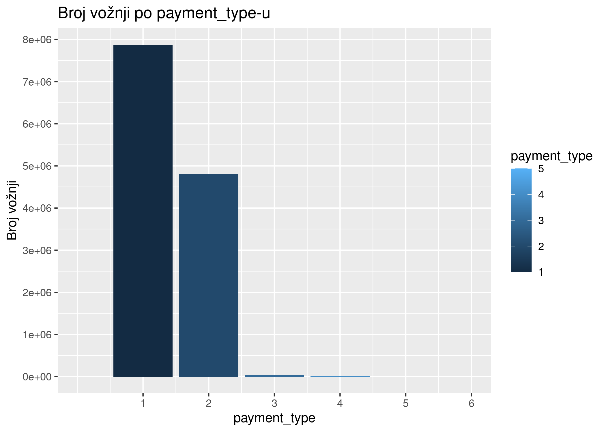
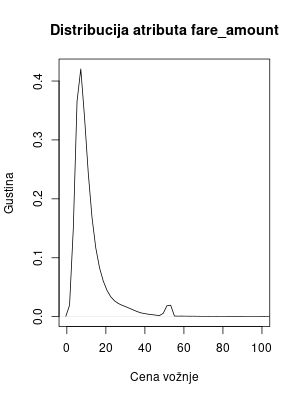

### Luka Ćirić, E2 18/2023
# Specifikacija
Specifikacija na [linku](http://www.acs.uns.ac.rs/sr/filebrowser/download/11975528)

# Opis skupa podataka
Skup podataka je javno dostupan za preuzimanje na [linku](https://www.nyc.gov/site/tlc/about/tlc-trip-record-data.page). 
Podaci originalno preuzeti u **PARQUET** formatu, a zatim konvertovani u **CSV** format.
Skup podataka se sastoji od podataka o kretanju taksi vozila i zaradi u Njujorku u januaru 2015. godine.

## Opis atributa
Skup podataka se sastoji od atributa:<br/>
1. **VendorID** - identifikator provajdera usluge taksi prevoza<br/>
2. **tpep_pickup_datetime** - datum i vreme preuzimanja putnika<br/>
3. **tpep_dropoff_datetime** - datum i vreme iskrcavanja putnika<br/>
4. **passenger_count** - broj putnika<br/>
5. **trip_distance** - dužina putovanja u miljama<br/>
6. **RatecodeID** - identifikator tarifnog koda<br/>
7. **store_and_fwd_flag** - indikator da li je vožnja prvo sačuvana u memoriji pre slanja<br/>
8. **PULocationID** - identifikator lokacije preuzimanja putnika<br/>
9. **DOLocationID** - identifikator lokacije iskrcavanja putnika<br/>
10. **payment_type** - način plaćanja<br/>
12. **fare_amount** - cena vožnje<br/>
13. **extra** - dodatni troškovi<br/>
14. **mta_tax** - troškovi MTA<br/>
15. **tip_amount** - napojnica (popunjena samo za plaćanje karticom)<br/>
16. **tolls_amount** - troškovi putarine<br/>
17. **improvement_surcharge** - troškovi poboljšanja<br/>
18. **total_amount** - ukupna cena<br/>
19. **congestion_surcharge** - troškovi gužve<br/>
20. **airport_fee** - troškovi aerodroma<br/>

Specifikacija obeležja dostupna na [linku](https://www.nyc.gov/assets/tlc/downloads/pdf/data_dictionary_trip_records_yellow.pdf)

## Kod za prevođenje podataka u CSV format (Python):
```python
import pandas as pd

def parquet_to_csv(parquet_file_path, csv_file_path):
    # Read the Parquet file into a DataFrame
    df = pd.read_parquet(parquet_file_path)
    
    # Write the DataFrame to a CSV file
    df.to_csv(csv_file_path, index=False)

if __name__ == "__main__":
    # Replace these with your actual file paths
    parquet_file_path = input("Enter input file: ") + ".parquet"
    csv_file_path = input("Enter output file: ") + ".csv"
    
    parquet_to_csv(parquet_file_path, csv_file_path)
    
```

# Implementacija
## Instalacija paketa
```{r Instalacija paketa, eval=FALSE, results='hide', message=FALSE, warning=FALSE, error=FALSE}
install.packages("tidyverse")
install.packages("sparklyr")
install.packages("rmarkdown")
install.packages("knitr")
install.packages("pandoc")
install.packages("dbplot")
```
## Učitavanje paketa
```{r Učitavanje paketa, results='hide', message=FALSE, warning=FALSE, error=FALSE}
library(sparklyr)
library(dplyr)
library(knitr)
library(rmarkdown)
library(ggplot2)
library(dbplot)
library(pandoc)
spark_install()
knitr::opts_knit$set(root.dir = file.path(getwd()))
```
## Podešavanje Spark sesije
```{r Podešavanje Spark sesije i knitr, results='hide', message=FALSE, warning=FALSE, error=FALSE}
conf <- spark_config()
conf["spark.executor.memory"] <- "6G"
conf["sparklyr.shell.driver-memory"] <- "6G"
sc <- spark_connect(master = "local", config = conf)
```
## Učitavanje skupa podataka
```{r Učitavanje skupa podataka, results='hide', message=FALSE, warning=FALSE, error=FALSE}
ds.path <- "~/FAX/RVPUII/projekat/data"
ds.df <- spark_read_csv(sc, name = "my_data", path = ds.path, header = TRUE, infer_schema = TRUE, memory = TRUE)
```

## Filtriranje skupa podataka
```{r Filtriranje skupa podataka, results='hide', message=FALSE, warning=FALSE, error=FALSE}
ds.filtered <- ds.df %>% 
    select(-store_and_fwd_flag, -airport_fee, -congestion_surcharge, -tpep_pickup_datetime, -tpep_dropoff_datetime) %>%
    filter(
      !(is.na(VendorID) || is.na(passenger_count) || is.na(trip_distance) || is.na(RatecodeID) ||
       is.na(PULocationID) || is.na(DOLocationID) || is.na(payment_type) || is.na(fare_amount) ||
       is.na(extra) || is.na(mta_tax) || is.na(tip_amount) || is.na(tolls_amount) || 
       is.na(improvement_surcharge) || is.na(total_amount))
    ) %>%
    filter(
        RatecodeID >= 1 && RatecodeID <= 6 &&
        trip_distance >= 0 && trip_distance <= 200 && 
        fare_amount >= 0 && fare_amount <= 200 &&
        extra >= 0 && extra <= 1 &&
        mta_tax >= 0 && mta_tax <= 1 &&
        tip_amount >= 0 && tip_amount <= 200 &&
        tolls_amount >= 0 && tolls_amount <= 200 && 
        improvement_surcharge >= 0 && improvement_surcharge <= 200 &&
        total_amount >= 0 && total_amount <= 300 &&
        payment_type >= 1 && payment_type <= 6
    )
```

## Dodavanje novih atributa
```{r Dodavanje novih atributa, results='hide', message=FALSE, warning=FALSE, error=FALSE}
data <- ds.filtered %>% 
    mutate(payed_with_card = ifelse(payment_type == 1, T, F))
```

## Analiza pojedinačnih atributa
### Analiza atributa VendorID
```{r Analiza atributa VendorID, message=FALSE, warning=FALSE, error=FALSE}
vendorIdCounts <- data %>%
    group_by(VendorID) %>% 
    summarise(count = n()) %>% 
    collect() %>% arrange(VendorID)

kable(vendorIdCounts)
```

```{r Vizuelizacija atributa VendorID, include=FALSE, message=FALSE, warning=FALSE, error=FALSE}
vds <- pull(data, VendorID)
png("images/vendorIdCounts.png", width = 800, height = 1200)
pi <- pie(table(vds), main = "Broj vožnji po VendorID-u", labels = c("VendorID 1", "VendorID 2"))
dev.off()
```


### Analiza atributa passenger_count
```{r Analiza atributa passenger_count, message=FALSE, warning=FALSE, error=FALSE}
passengerCountCounts <- data %>%
    group_by(passenger_count) %>% 
    summarise(count = n()) %>% 
    collect() %>% arrange(passenger_count)

kable(passengerCountCounts)
```
```{r Vizuelizacija atributa passenger_count, include=FALSE, message=FALSE, warning=FALSE, error=FALSE}
passengerCounts <- pull(data, passenger_count)

png("images/passengerCountHistogram.png", width = 800, height = 1200)
xgran <- pretty(passengerCounts, n = 10)
xlabel <- seq(1, 8, 1)
hst <- hist(passengerCounts, main = "Broj vožnji po broju putnika", xlab = "Broj putnika", ylab = "Broj vožnji")
axis(1, at = xlabel, labels = xlabel)
ygran <- pretty(hst$counts, n = 10)
ylabel <- replace(ygran, ygran %% 1000000 != 0, NA)
axis(2, at = ygran, labels = ylabel)
dev.off()
```


### Analiza atributa trip_distance
```{r Analiza atributa trip_distance, message=FALSE, warning=FALSE, error=FALSE}
tripDistanceCounts <- data %>%
    summarise(min = min(trip_distance), max = max(trip_distance), avg = mean(trip_distance), median = median(trip_distance)) %>%
    collect()


kable(tripDistanceCounts)
```
```{r Vizuelizacija atributa trip_distance, include=FALSE, message=FALSE, warning=FALSE, error=FALSE}
tripDistances <- pull(data, trip_distance)
png("images/tripDistanceDensity.png", width = 800, height = 1200)
plt <- plot(density(tripDistances), main = "Distribucija atributa trip_distance", xlab = "Dužina putovanja", ylab = "Gustina")
dev.off()
```


### Analiza atributa RatecodeID
```{r Analiza atributa RatecodeID, message=FALSE, warning=FALSE, error=FALSE}
ratecodeIdCounts <- data %>%
    group_by(RatecodeID) %>% 
    summarise(count = n()) %>% 
    collect() %>% arrange(RatecodeID)


kable(ratecodeIdCounts)
```
```{r Vizuelizacija atributa RatecodeID, include=FALSE, message=FALSE, warning=FALSE, error=FALSE}
bar <- ggplot(ratecodeIdCounts, aes(x = RatecodeID, y = count, fill = RatecodeID)) +
    geom_bar(stat = "identity") +
    labs(title = "Broj vožnji po RatecodeID-u", x = "RatecodeID", y = "Broj vožnji") +
    scale_y_continuous(breaks = seq(0, 20000000, 1000000)) +
    scale_x_continuous(breaks = seq(0, 6, 1), limits = c(0, 6))

ggsave("images/ratecodeIdCounts.png", bar)
```


### Analiza atributa PULocationID
```{r Analiza atributa PULocationID, message=FALSE, warning=FALSE, error=FALSE}
puLocationIdCounts <- data %>%
    group_by(PULocationID) %>% 
    summarise(count = n()) %>% 
    collect() %>% arrange(PULocationID)


kable(puLocationIdCounts)
```
```{r Vizuelizacija atributa PULocationID, include=FALSE, message=FALSE, warning=FALSE, error=FALSE}
puLocationIds <- pull(data, PULocationID)
png("images/puLocationIdHistogram.png", width = 800, height = 1200)
hst <- hist(puLocationIds, main = "Broj vožnji po PULocationID-u", xlab = "PULocationID", ylab = "Broj vožnji")
dev.off()
```


### Analiza atributa DOLocationID
```{r Analiza atributa DOLocationID, message=FALSE, warning=FALSE, error=FALSE}
doLocationIdCounts <- data %>%
    group_by(DOLocationID) %>% 
    summarise(count = n()) %>% 
    collect() %>% arrange(DOLocationID)


kable(doLocationIdCounts)
```
```{r Vizuelizacija atributa DOLocationID, include=FALSE, message=FALSE, warning=FALSE, error=FALSE}
doLocationIds <- pull(data, DOLocationID)
png("images/doLocationIdHistogram.png", width = 800, height = 1200)
hst <- hist(doLocationIds, main = "Broj vožnji po DOLocationID-u", xlab = "DOLocationID", ylab = "Broj vožnji")
dev.off()
```


### Analiza atributa payment_type
```{r Analiza atributa payment_type, message=FALSE, warning=FALSE, error=FALSE}
paymentTypeCounts <- data %>%
    group_by(payment_type) %>% 
    summarise(count = n()) %>% 
    collect() %>% arrange(payment_type)


kable(paymentTypeCounts)
```
```{r Vizuelizacija atributa payment_type, include=FALSE, message=FALSE, warning=FALSE, error=FALSE}
bar <- ggplot(paymentTypeCounts, aes(x = payment_type, y = count, fill = payment_type)) +
    geom_bar(stat = "identity") +
    labs(title = "Broj vožnji po payment_type-u", x = "payment_type", y = "Broj vožnji") +
    scale_y_continuous(breaks = seq(0, 20000000, 1000000)) +
    scale_x_continuous(breaks = seq(1, 6, 1), limits = c(0, 6))

ggsave("images/paymentTypeCounts.png", bar)
```


### Analiza atributa fare_amount
```{r Analiza atributa fare_amount, message=FALSE, warning=FALSE, error=FALSE}
fareAmountCounts <- data %>%
    summarise(min = min(fare_amount), max = max(fare_amount), avg = mean(fare_amount), median = median(fare_amount)) %>%
    collect()


kable(fareAmountCounts)
```
```{r Vizuelizacija atributa fare_amount, include=FALSE, message=FALSE, warning=FALSE, error=FALSE}
fareAmounts <- pull(data, fare_amount)
png("images/fareAmountDensity.png", width = 800, height = 1200)

plt <- plot(density(fareAmounts), main = "Distribucija atributa fare_amount", xlab = "Cena vožnje", ylab = "Gustina", xlim = c(0, 100))

dev.off()
```


### Analiza atributa extra
```{r Analiza atributa extra, message=FALSE, warning=FALSE, error=FALSE}
extraCounts <- data %>%
    group_by(extra) %>%
    summarise(count = n()) %>%
    collect() %>% arrange(extra)


kable(extraCounts)
```
```{r Vizuelizacija atributa extra, include=FALSE, message=FALSE, warning=FALSE, error=FALSE}
extraValues <- pull(data, extra)
bar <- ggplot(extraCounts, aes(x = extra, y = count, fill = extra)) +
    geom_bar(stat = "identity", width = 0.4) +
    labs(title = "Broj vožnji po extra", x = "extra", y = "Broj vožnji") +
    scale_y_continuous(breaks = seq(0, 5000000, 1000000), limits=c(0, 5000000)) + 
    scale_x_continuous(breaks = seq(0, 1, 0.5), limits=c(0, 1.5))

ggsave("images/extraCounts.png", bar)
```


### Analiza atributa mta_tax
```{r Analiza atributa mta_tax, message=FALSE, warning=FALSE, error=FALSE}
mtaTaxCounts <- data %>%
    group_by(mta_tax) %>%
    summarise(count = n()) %>%
    collect() %>% arrange(mta_tax)


kable(mtaTaxCounts)
```
```{r Vizuelizacija atributa mta_tax, include=FALSE, message=FALSE, warning=FALSE, error=FALSE}
mtaTaxValues <- pull(data, mta_tax)
bar <- ggplot(mtaTaxCounts, aes(x = mta_tax, y = count, fill = mta_tax)) +
    geom_bar(stat = "identity", width = 0.4) +
    labs(title = "Broj vožnji po mta_tax", x = "mta_tax", y = "Broj vožnji") +
    scale_y_continuous(breaks = seq(0, 13000000, 1000000), limits=c(0, 13000000)) + 
    scale_x_continuous(breaks = seq(-1, 1, 0.5), limits=c(-1, 1))

ggsave("images/mtaTaxCounts.png", bar)
```


### Analiza atributa tip_amount
```{r Analiza atributa tip_amount, message=FALSE, warning=FALSE, error=FALSE}
tipAmountCounts <- data %>%
    summarise(min = min(tip_amount), max = max(tip_amount), avg = mean(tip_amount), median = median(tip_amount)) %>%
    collect()


kable(tipAmountCounts)
```
```{r Vizuelizacija atributa tip_amount, include=FALSE, message=FALSE, warning=FALSE, error=FALSE}
tipAmounts <- pull(data, tip_amount)
png("images/tipAmountDensity.png", width = 800, height = 1200)
plt <- plot(density(tipAmounts), main = "Distribucija atributa tip_amount", xlab = "Napojnica", ylab = "Gustina", xlim = c(0, 20))
dev.off()
```


### Analiza atributa tolls_amount
```{r Analiza atributa tolls_amount, message=FALSE, warning=FALSE, error=FALSE}
tollsAmountCounts <- data %>%
    summarise(min = min(tolls_amount), max = max(tolls_amount), avg = mean(tolls_amount), median = median(tolls_amount)) %>%
    collect()


kable(tollsAmountCounts)
```
```{r Vizuelizacija atributa tolls_amount, include=FALSE, message=FALSE, warning=FALSE, error=FALSE}
tollsAmounts <- pull(data, tolls_amount)
png("images/tollsAmountDensity.png", width = 800, height = 1200)
plt <- plot(density(tollsAmounts), main = "Distribucija atributa tolls_amount", xlab = "Troškovi putarine", ylab = "Gustina",  xlim = c(0, 20))
dev.off()
```


### Analiza atributa improvement_surcharge
```{r Analiza atributa improvement_surcharge, message=FALSE, warning=FALSE, error=FALSE}
improvementSurchargeCounts <- data %>%
    summarise(min = min(improvement_surcharge), max = max(improvement_surcharge), avg = mean(improvement_surcharge), median = median(improvement_surcharge)) %>%
    collect()

kable(improvementSurchargeCounts)
```
```{r Vizuelizacija atributa improvement_surcharge, include=FALSE, message=FALSE, warning=FALSE, error=FALSE}
improvementSurcharge <- pull(data, improvement_surcharge)
png("images/improvementSurchargeDensity.png", width = 800, height = 1200)
plt <- plot(density(improvementSurcharge), main = "Distribucija atributa improvement_surcharge", xlab = "Troškovi poboljšanja", ylab = "Gustina", xlim = c(0, 0.4))
dev.off()
```


### Analiza atributa total_amount
```{r Analiza atributa total_amount, message=FALSE, warning=FALSE, error=FALSE}
totalAmountCounts <- data %>%
    summarise(min = min(total_amount), max = max(total_amount), avg = mean(total_amount), median = median(total_amount)) %>%
    collect()

kable(totalAmountCounts)
```
```{r Vizuelizacija atributa total_amount, include=FALSE, message=FALSE, warning=FALSE, error=FALSE}
totalAmount <- pull(data, total_amount)
png("images/totalAmountDensity.png", width = 800, height = 1200)
plt <- plot(density(totalAmount), main = "Distribucija atributa total_amount", xlab = "Ukupna cena", ylab = "Gustina", xlim = c(0, 300))
dev.off()
```


### Analiza atributa payed_with_card
```{r Analiza atributa payed_with_card, message=FALSE, warning=FALSE, error=FALSE}
payedWithCardCounts <- data %>%
    group_by(payed_with_card) %>%
    summarise(count = n()) %>%
    collect()

kable(payedWithCardCounts)
```
```{r Vizuelizacija atributa payed_with_card, include=FALSE, message=FALSE, warning=FALSE, error=FALSE}
py <- pull(data, payed_with_card)
png("images/payedWithCardCounts.png", width = 800, height = 1200)
pi <- pie(table(py), main = "Broj vožnji po načinu plaćanja", labels = c("Plaćeno karticom", "Nije plaćeno karticom"))
dev.off()
```


## Analiza zavisnosti atributa
### Analiza zavisnosti atributa VendorID i passenger_count
```{r Analiza zavisnosti atributa VendorID i passenger_count, message=FALSE, warning=FALSE, error=FALSE}
vendorIdPassengerCount <- data %>%
    group_by(VendorID, passenger_count) %>%
    summarise(count = n()) %>%
    collect() %>% arrange(VendorID, passenger_count)

kable(vendorIdPassengerCount)
```
```{r Vizuelizacija zavisnosti atributa VendorID i passenger_count, include=FALSE, message=FALSE, warning=FALSE, error=FALSE}
vxp <- data %>%
    select(VendorID, passenger_count) %>%
    collect()

png("images/vendorIdPassengerCount.png", width = 800, height = 1200)
boxplot(passenger_count ~ VendorID, data = vxp, main = "Broj vožnji po VendorID-u i broju putnika", xlab = "VendorID", ylab = "Broj putnika")
dev.off()
```


### Analiza zavisnosti atributa VendorID i trip_distance
```{r Analiza zavisnosti atributa VendorID i trip_distance, message=FALSE, warning=FALSE, error=FALSE}
vendorIdTripDistance <- data %>%
    group_by(VendorID) %>%
    summarise(min = min(trip_distance), max = max(trip_distance), avg = mean(trip_distance), median = median(trip_distance)) %>%
    collect()

kable(vendorIdTripDistance)
```
```{r Vizuelizacija zavisnosti atributa VendorID i trip_distance, include=FALSE, message=FALSE, warning=FALSE, error=FALSE}
vtd <- data %>%
    select(VendorID, trip_distance) %>%
    collect()

png("images/vendorIdTripDistance.png", width = 800, height = 1200)
boxplot(trip_distance ~ VendorID, data = vtd, main = "Dužina putovanja po VendorID-u", xlab = "VendorID", ylab = "Dužina putovanja")
dev.off()
```


### Analiza zavisnosti atributa VendorID i RatecodeID
```{r Analiza zavisnosti atributa VendorID i RatecodeID, message=FALSE, warning=FALSE, error=FALSE}
vendorIdRatecodeId <- data %>%
    group_by(VendorID, RatecodeID) %>%
    summarise(count = n()) %>%
    collect() %>% arrange(VendorID, RatecodeID)

kable(vendorIdRatecodeId)
```
```{r Vizuelizacija zavisnosti atributa VendorID i RatecodeID, include=FALSE, message=FALSE, warning=FALSE, error=FALSE}
vri <- data %>%
    select(VendorID, RatecodeID) %>%
    filter(RatecodeID >= 1 && RatecodeID <= 6) %>%
    collect()

png("images/vendorIdRatecodeId.png", width = 800, height = 1200)
barplot(table(vri), beside = T, main = "Broj vožnji po VendorID-u i RatecodeID-u", xlab = "VendorID", ylab = "Broj vožnji", col = c("red", "blue"), legend = rownames(m))
dev.off()
```


### Analiza zavisnosti atributa VendorID i PULocationID
```{r Analiza zavisnosti atributa VendorID i PULocationID, message=FALSE, warning=FALSE, error=FALSE}
vendorIdPULocationId <- data %>%
    group_by(VendorID, PULocationID) %>%
    summarise(count = n()) %>%
    collect() %>% arrange(VendorID, PULocationID)

kable(vendorIdPULocationId)
```
```{r Vizuelizacija zavisnosti atributa VendorID i PULocationID, include=FALSE, message=FALSE, warning=FALSE, error=FALSE}
vpli <- data %>%
    select(VendorID, PULocationID) %>%
    collect()

png("images/vendorIdPULocationId.png", width = 800, height = 1200)
boxplot(PULocationID ~ VendorID, data = vpli, main = "Broj vožnji po VendorID-u i PULocationID-u", xlab = "VendorID", ylab = "PULocationID")
dev.off()
```


### Analiza zavisnosti atributa VendorID i DOLocationID
```{r Analiza zavisnosti atributa VendorID i DOLocationID, message=FALSE, warning=FALSE, error=FALSE}
vendorIdDOLocationId <- data %>%
    group_by(VendorID, DOLocationID) %>%
    summarise(count = n()) %>%
    collect() %>% arrange(VendorID, DOLocationID)

kable(vendorIdDOLocationId)
```
```{r Vizuelizacija zavisnosti atributa VendorID i DOLocationID, include=FALSE, message=FALSE, warning=FALSE, error=FALSE}
vdli <- data %>%
    select(VendorID, DOLocationID) %>%
    collect()

png("images/vendorIdDOLocationId.png", width = 800, height = 1200)
boxplot(DOLocationID ~ VendorID, data = vdli, main = "Broj vožnji po VendorID-u i DOLocationID-u", xlab = "VendorID", ylab = "DOLocationID")
dev.off()
```


### Analiza zavisnosti atributa VendorID i payment_type
```{r Analiza zavisnosti atributa VendorID i payment_type, message=FALSE, warning=FALSE, error=FALSE}
vendorIdPaymentType <- data %>%
    group_by(VendorID, payment_type) %>%
    summarise(count = n()) %>%
    collect() %>% arrange(VendorID, payment_type)

kable(vendorIdPaymentType)
```
```{r Vizuelizacija zavisnosti atributa VendorID i payment_type, include=FALSE, message=FALSE, warning=FALSE, error=FALSE}
vpt <- data %>%
    select(VendorID, payment_type) %>%
    collect()

png("images/vendorIdPaymentType.png", width = 800, height = 1200)
barplot(table(vpt), beside = T, main = "Broj vožnji po VendorID-u i payment_type-u", xlab = "VendorID", ylab = "Broj vožnji", col = c("red", "blue", "green", "yellow", "purple", "orange"), legend = rownames(table(vpt)))
dev.off()
```


### Analiza zavisnosti atributa VendorID i fare_amount
```{r Analiza zavisnosti atributa VendorID i fare_amount, message=FALSE, warning=FALSE, error=FALSE}
vendorIdFareAmount <- data %>%
    group_by(VendorID) %>%
    summarise(min = min(fare_amount), max = max(fare_amount), avg = mean(fare_amount), median = median(fare_amount)) %>%
    collect()

kable(vendorIdFareAmount)
```
```{r Vizuelizacija zavisnosti atributa VendorID i fare_amount, include=FALSE, message=FALSE, warning=FALSE, error=FALSE}
vfa <- data %>%
    select(VendorID, fare_amount) %>%
    collect()

png("images/vendorIdFareAmount.png", width = 800, height = 1200)
boxplot(fare_amount ~ VendorID, data = vfa, main = "Cena vožnje po VendorID-u", xlab = "VendorID", ylab = "Cena vožnje")
dev.off()
```


### Analiza zavisnosti atributa VendorID i extra
```{r Analiza zavisnosti atributa VendorID i extra, message=FALSE, warning=FALSE, error=FALSE}
vendorIdExtra <- data %>%
    group_by(VendorID) %>%
    summarise(min = min(extra), max = max(extra), avg = mean(extra), median = median(extra)) %>%
    collect()

kable(vendorIdExtra)
```
```{r Vizuelizacija zavisnosti atributa VendorID i extra, include=FALSE, message=FALSE, warning=FALSE, error=FALSE}
vex <- data %>%
    select(VendorID, extra) %>%
    collect()

png("images/vendorIdExtra.png", width = 800, height = 1200)
barplot(table(vex), beside = T, main = "Broj vožnji po VendorID-u i extra", 
    xlab = "VendorID", ylab = "Broj vožnji", col = c("red", "blue"), 
    legend = rownames(table(vex)),)
dev.off()
```


### Analiza zavisnosti atributa VendorID i mta_tax
```{r Analiza zavisnosti atributa VendorID i mta_tax, message=FALSE, warning=FALSE, error=FALSE}
vendorIdMtaTax <- data %>%
    group_by(VendorID, mta_tax) %>%
    collect()

kable(vendorIdMtaTax)
```
```{r Vizuelizacija zavisnosti atributa VendorID i mta_tax, include=FALSE, message=FALSE, warning=FALSE, error=FALSE}
vmt <- data %>%
    select(VendorID, mta_tax) %>%
    collect()

png("images/vendorIdMtaTax.png", width = 800, height = 1200)
mosaicplot(table(vmt), main = "Broj vožnji po VendorID-u i mta_tax", xlab = "VendorID", ylab = "mta_tax", color = c("red", "blue", "green", "yellow", "purple", "orange"))
dev.off()
```


### Analiza zavisnosti atributa VendorID i tip_amount
```{r Analiza zavisnosti atributa VendorID i tip_amount, message=FALSE, warning=FALSE, error=FALSE}
vendorIdTipAmount <- data %>%
    group_by(VendorID) %>%
    summarise(min = min(tip_amount), max = max(tip_amount), avg = mean(tip_amount), median = median(tip_amount)) %>%
    collect()

kable(vendorIdTipAmount)
```
```{r Vizuelizacija zavisnosti atributa VendorID i tip_amount, include=FALSE, message=FALSE, warning=FALSE, error=FALSE}
vta <- data %>%
    select(VendorID, tip_amount) %>%
    collect()

png("images/vendorIdTipAmount.png", width = 800, height = 1200)
boxplot(tip_amount ~ VendorID, data = vta, main = "Napojnica po VendorID-u", xlab = "VendorID", ylab = "Napojnica")
dev.off()
```


