### Luka Ćirić, E2 18/2023
# Specifikacija
Specifikacija na [linku](http://www.acs.uns.ac.rs/sr/filebrowser/download/11975528)

# Opis skupa podataka
Skup podataka je javno dostupan za preuzimanje na [linku](https://www.nyc.gov/site/tlc/about/tlc-trip-record-data.page). 
Podaci originalno preuzeti u **PARQUET** formatu, a zatim konvertovani u **CSV** format.
Skup podataka se sastoji od podataka o kretanju taksi vozila i zaradi u Njujorku u januaru 2015. godine.

## Opis atributa
Skup podataka se sastoji od atributa:<br/>
1. **VendorID** - identifikator provajdera usluge taksi prevoza<br/>
2. **tpep_pickup_datetime** - datum i vreme preuzimanja putnika<br/>
3. **tpep_dropoff_datetime** - datum i vreme iskrcavanja putnika<br/>
4. **passenger_count** - broj putnika<br/>
5. **trip_distance** - dužina putovanja u miljama<br/>
6. **RatecodeID** - identifikator tarifnog koda<br/>
7. **store_and_fwd_flag** - indikator da li je vožnja prvo sačuvana u memoriji pre slanja<br/>
8. **PULocationID** - identifikator lokacije preuzimanja putnika<br/>
9. **DOLocationID** - identifikator lokacije iskrcavanja putnika<br/>
10. **payment_type** - način plaćanja<br/>
12. **fare_amount** - cena vožnje<br/>
13. **extra** - dodatni troškovi<br/>
14. **mta_tax** - troškovi MTA<br/>
15. **tip_amount** - napojnica (popunjena samo za plaćanje karticom)<br/>
16. **tolls_amount** - troškovi putarine<br/>
17. **improvement_surcharge** - troškovi poboljšanja<br/>
18. **total_amount** - ukupna cena<br/>
19. **congestion_surcharge** - troškovi gužve<br/>
20. **airport_fee** - troškovi aerodroma<br/>

Specifikacija obeležja dostupna na [linku](https://www.nyc.gov/assets/tlc/downloads/pdf/data_dictionary_trip_records_yellow.pdf)

## Kod za prevođenje podataka u CSV format (Python):
```python
import pandas as pd

def parquet_to_csv(parquet_file_path, csv_file_path):
    # Read the Parquet file into a DataFrame
    df = pd.read_parquet(parquet_file_path)
    
    # Write the DataFrame to a CSV file
    df.to_csv(csv_file_path, index=False)

if __name__ == "__main__":
    # Replace these with your actual file paths
    parquet_file_path = input("Enter input file: ") + ".parquet"
    csv_file_path = input("Enter output file: ") + ".csv"
    
    parquet_to_csv(parquet_file_path, csv_file_path)
    
```
# Implementacija
Implementacija radjena u **R** programskom jeziku, korišćenjem **R Markdown** dokumenta.
## Instalacija
### Instalacija paketa
```{r Instalacija paketa, results='hide', eval=FALSE, message=FALSE, warning=FALSE, error=FALSE}
install.packages("tidyverse")
install.packages("sparklyr")
install.packages("rmarkdown")
install.packages("knitr")
install.packages("pandoc")
install.packages("dbplot")
install.packages("ggcorrplot")
```
### Učitavanje paketa
```{r Učitavanje paketa, results='hide', message=FALSE, warning=FALSE, error=FALSE}
library(sparklyr)
library(dplyr)
library(knitr)
library(rmarkdown)
library(ggplot2)
library(ggcorrplot)
library(dbplot)
library(pandoc)
spark_install()
knitr::opts_knit$set(root.dir = file.path(getwd()))
```
### Podešavanje Spark sesije
```{r Podešavanje Spark sesije i knitr, results='hide', message=FALSE, warning=FALSE, error=FALSE}
conf <- spark_config()
conf["spark.memory.fraction"] <- 0.9
conf["sparklyr.shell.driver-memory"] <- "16G"
sc <- spark_connect(master = "local", config = conf)
```
## Podaci
### Učitavanje skupa podataka
```{r Učitavanje skupa podataka, results='hide', message=FALSE, warning=FALSE, error=FALSE}
ds.path <- "~/FAX/RVPUII/projekat/data"
ds.df <- spark_read_csv(sc, name = "my_data", path = ds.path, header = TRUE, infer_schema = TRUE, memory = TRUE)
```
### Filtriranje skupa podataka
```{r Filtriranje skupa podataka, results='hide', message=FALSE, warning=FALSE, error=FALSE}
ds.filtered <- ds.df %>% 
    select(passenger_count, trip_distance, payment_type, fare_amount, tip_amount, tolls_amount, total_amount) %>%
    filter(
      !(is.na(passenger_count) || is.na(trip_distance) || is.na(payment_type) || 
        is.na(fare_amount) || is.na(total_amount) || is.na(tip_amount) || is.na(tolls_amount))
    ) %>%
    filter(
        trip_distance >= 0 && trip_distance <= 200 && 
        fare_amount >= 0 && fare_amount <= 1000 &&
        tip_amount >= 0 && tip_amount <= 200 &&
        tolls_amount >= 0 && tolls_amount <= 200 && 
        total_amount >= 0 && total_amount <= 1000 &&
        payment_type >= 1 && payment_type <= 6 &&
        passenger_count >= 1 && passenger_count <= 8
    )
```

### Dodavanje novih atributa
```{r Dodavanje novih atributa, results='hide', message=FALSE, warning=FALSE, error=FALSE}
data <- ds.filtered %>% 
    mutate(tip_status = cut(
        tip_amount,
        breaks = c(0, 1, 5, 10, Inf),
        labels = c("NONE", "LOW", "MID", "HIGH"),
        right = FALSE
    ))
```
### Funkcija za čišćenje memorije
```{r Funkcija za čišćenje memorije 1, results='hide', message=FALSE, warning=FALSE, error=FALSE}
clearFn <- function() {
    all_objects <- ls()
    needed_to_keep <- c("sc", "ds.df", "ds.filtered", "data", "conf", "clearFn")
    to_remove <- setdiff(all_objects, needed_to_keep)
    rm(list = to_remove)
}
```
## Analiza pojedinačnih atributa
### Analiza atributa passenger_count
```{r Analiza atributa passenger_count, message=FALSE, warning=FALSE, error=FALSE}
passengerCountCounts <- data %>%
    group_by(passenger_count) %>% 
    summarise(count = n()) %>% 
    collect() %>% arrange(passenger_count)

kable(passengerCountCounts)
```
```{r Vizuelizacija atributa passenger_count, include=FALSE, eval=FALSE, message=FALSE, warning=FALSE, error=FALSE}
passengerCounts <- pull(data, passenger_count)

png("images/passengerCountHistogram.png", width = 300, height = 400)
xgran <- pretty(passengerCounts, n = 10)
xlabel <- seq(1, 8, 1)
hst <- hist(passengerCounts, main = "Broj vožnji po broju putnika", xlab = "Broj putnika", ylab = "Broj vožnji")
axis(1, at = xlabel, labels = xlabel)
ygran <- pretty(hst$counts, n = 10)
ylabel <- replace(ygran, ygran %% 1000000 != 0, NA)
axis(2, at = ygran, labels = ylabel)
dev.off()
clearFn()
```


### Analiza atributa trip_distance
```{r Analiza atributa trip_distance, message=FALSE, warning=FALSE, error=FALSE}
tripDistanceCounts <- data %>%
    summarise(min = min(trip_distance), max = max(trip_distance), avg = mean(trip_distance), median = median(trip_distance)) %>%
    collect()

kable(tripDistanceCounts)
```
```{r Vizuelizacija atributa trip_distance, include=FALSE, eval=FALSE, message=FALSE, warning=FALSE, error=FALSE}
tripDistances <- pull(data, trip_distance)
png("images/tripDistanceDensity.png", width = 300, height = 400)
plt <- plot(density(tripDistances), main = "Distribucija atributa trip_distance", xlab = "Dužina putovanja", ylab = "Gustina")
dev.off()
clearFn()
```
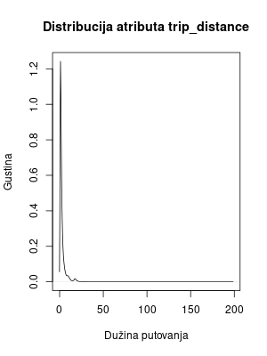

### Analiza atributa payment_type
```{r Analiza atributa payment_type, message=FALSE, warning=FALSE, error=FALSE}
paymentTypeCounts <- data %>%
    group_by(payment_type) %>% 
    summarise(count = n()) %>% 
    collect() %>% arrange(payment_type)

kable(paymentTypeCounts)
```
```{r Vizuelizacija atributa payment_type, include=FALSE, eval=FALSE, message=FALSE, warning=FALSE, error=FALSE}
bar <- ggplot(paymentTypeCounts, aes(x = payment_type, y = count, fill = payment_type)) +
    geom_bar(stat = "identity") +
    labs(title = "Broj vožnji po payment_type-u", x = "payment_type", y = "Broj vožnji") +
    scale_y_continuous(breaks = seq(0, 20000000, 1000000)) +
    scale_x_continuous(breaks = seq(1, 6, 1), limits = c(0, 6))

ggsave("images/paymentTypeCounts.png", bar)
clearFn()
```


### Analiza atributa fare_amount
```{r Analiza atributa fare_amount, message=FALSE, warning=FALSE, error=FALSE}
fareAmountCounts <- data %>%
    summarise(min = min(fare_amount), max = max(fare_amount), avg = mean(fare_amount), median = median(fare_amount)) %>%
    collect()


kable(fareAmountCounts)
```
```{r Vizuelizacija atributa fare_amount, include=FALSE, eval=FALSE, message=FALSE, warning=FALSE, error=FALSE}
fareAmounts <- pull(data, fare_amount)
png("images/fareAmountDensity.png", width = 300, height = 400)

plt <- plot(density(fareAmounts), main = "Distribucija atributa fare_amount", xlab = "Cena vožnje", ylab = "Gustina", xlim = c(0, 100))

dev.off()
clearFn()
```


### Analiza atributa tip_amount
```{r Analiza atributa tip_amount, message=FALSE, warning=FALSE, error=FALSE}
tipAmountCounts <- data %>%
    summarise(min = min(tip_amount), max = max(tip_amount), avg = mean(tip_amount), median = median(tip_amount)) %>%
    collect()


kable(tipAmountCounts)
```
```{r Vizuelizacija atributa tip_amount, include=FALSE, eval=FALSE, message=FALSE, warning=FALSE, error=FALSE}
tipAmounts <- pull(data, tip_amount)
png("images/tipAmountDensity.png", width = 300, height = 400)
plt <- plot(density(tipAmounts), main = "Distribucija atributa tip_amount", xlab = "Napojnica", ylab = "Gustina", xlim = c(0, 20))
dev.off()
clearFn()
```
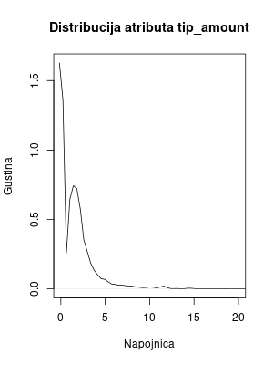

### Analiza atributa tolls_amount
```{r Analiza atributa tolls_amount, message=FALSE, warning=FALSE, error=FALSE}
tollsAmountCounts <- data %>%
    summarise(min = min(tolls_amount), max = max(tolls_amount), avg = mean(tolls_amount), median = median(tolls_amount)) %>%
    collect()


kable(tollsAmountCounts)
```
```{r Vizuelizacija atributa tolls_amount, include=FALSE, eval=FALSE, message=FALSE, warning=FALSE, error=FALSE}
tollsAmounts <- pull(data, tolls_amount)
png("images/tollsAmountDensity.png", width = 300, height = 400)
plt <- plot(density(tollsAmounts), main = "Distribucija atributa tolls_amount", xlab = "Troškovi putarine", ylab = "Gustina",  xlim = c(0, 20))
dev.off()
clearFn()
```


### Analiza atributa total_amount
```{r Analiza atributa total_amount, message=FALSE, warning=FALSE, error=FALSE}
totalAmountCounts <- data %>%
    summarise(min = min(total_amount), max = max(total_amount), avg = mean(total_amount), median = median(total_amount)) %>%
    collect()

kable(totalAmountCounts)
```
```{r Vizuelizacija atributa total_amount, include=FALSE, eval=FALSE, message=FALSE, warning=FALSE, error=FALSE}
totalAmount <- pull(data, total_amount)
png("images/totalAmountDensity.png", width = 300, height = 400)
plt <- plot(density(totalAmount), main = "Distribucija atributa total_amount", xlab = "Ukupna cena", ylab = "Gustina", xlim = c(0, 300))
dev.off()
clearFn()
```


### Analiza atributa tip_status
```{r Analiza atributa tip_status, message=FALSE, warning=FALSE, error=FALSE}
tipStatusCounts <- data %>%
    group_by(tip_status) %>%
    summarise(count = n()) %>%
    collect()

kable(tipStatusCounts)
```
```{r Vizuelizacija atributa tip_status, include=FALSE, eval=FALSE, message=FALSE, warning=FALSE, error=FALSE}
py <- pull(data, tip_status)
png("images/tipStatusCounts.png", width = 300, height = 400)
pi <- pie(table(py), main = "Broj vožnji po načinu plaćanja")
dev.off()
clearFn()
```
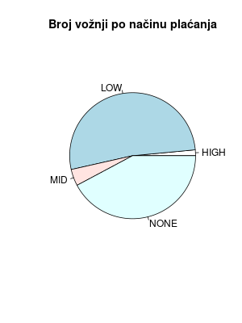

## Analiza zavisnosti atributa
### Analiza zavisnosti atributa passenger_count i trip_distance
```{r Analiza zavisnosti atributa passenger_count i trip_distance, message=FALSE, warning=FALSE, error=FALSE}
passengerCountTripDistance <- data %>%
    group_by(passenger_count) %>%
    summarise(min = min(trip_distance), max = max(trip_distance), avg = mean(trip_distance), median = median(trip_distance)) %>%
    collect()

kable(passengerCountTripDistance)
```
```{r Vizuelizacija zavisnosti atributa passenger_count i trip_distance, include=FALSE, eval=FALSE, message=FALSE, warning=FALSE, error=FALSE}
ptd <- data %>%
    select(passenger_count, trip_distance) %>%
    collect()

png("images/passengerCountTripDistance.png", width = 300, height = 400)
boxplot(trip_distance ~ passenger_count, data = ptd, main = "Dužina putovanja po broju putnika", xlab = "Broj putnika", ylab = "Dužina putovanja")
dev.off()
clearFn()
```


### Analiza zavisnosti atributa passenger_count i payment_type
```{r Analiza zavisnosti atributa passenger_count i payment_type, message=FALSE, warning=FALSE, error=FALSE}
passengerCountPaymentType <- data %>%
    group_by(passenger_count, payment_type) %>%
    summarise(count = n()) %>%
    collect() %>% arrange(passenger_count, payment_type)

kable(passengerCountPaymentType)
```
```{r Vizuelizacija zavisnosti atributa passenger_count i payment_type, include=FALSE, eval=FALSE, message=FALSE, warning=FALSE, error=FALSE}
ppt <- data %>%
    select(passenger_count, payment_type) %>%
    collect()

png("images/passengerCountPaymentType.png", width = 300, height = 400)
mosaicplot(table(ppt), main = "Broj vožnji po broju putnika i payment_type-u", xlab = "Broj putnika", ylab = "payment_type", color = c("red", "blue", "green", "yellow", "purple", "orange"))
dev.off()
clearFn()
```


### Analiza zavisnosti atributa passenger_count i fare_amount
```{r Analiza zavisnosti atributa passenger_count i fare_amount, message=FALSE, warning=FALSE, error=FALSE}
passengerCountFareAmount <- data %>%
    group_by(passenger_count) %>%
    summarise(min = min(fare_amount), max = max(fare_amount), avg = mean(fare_amount), median = median(fare_amount)) %>%
    collect()

kable(passengerCountFareAmount)
```
```{r Vizuelizacija zavisnosti atributa passenger_count i fare_amount, include=FALSE, eval=FALSE, message=FALSE, warning=FALSE, error=FALSE}
pfa <- data %>%
    select(passenger_count, fare_amount) %>%
    collect()

png("images/passengerCountFareAmount.png", width = 300, height = 400)
boxplot(fare_amount ~ passenger_count, data = pfa, main = "Cena vožnje po broju putnika", xlab = "Broj putnika", ylab = "Cena vožnje")
dev.off()
clearFn()
```
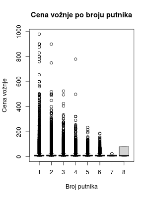

### Analiza zavisnosti atributa passenger_count i tip_amount
```{r Analiza zavisnosti atributa passenger_count i tip_amount, message=FALSE, warning=FALSE, error=FALSE}
passengerCountTipAmount <- data %>%
    group_by(passenger_count) %>%
    summarise(min = min(tip_amount), max = max(tip_amount), avg = mean(tip_amount), median = median(tip_amount)) %>%
    collect()
    
kable(passengerCountTipAmount)
```
```{r Vizuelizacija zavisnosti atributa passenger_count i tip_amount, include=FALSE, eval=FALSE, message=FALSE, warning=FALSE, error=FALSE}
pta <- data %>%
    select(passenger_count, tip_amount) %>%
    collect()

png("images/passengerCountTipAmount.png", width = 300, height = 400)
boxplot(tip_amount ~ passenger_count, data = pta, main = "Napojnica po broju putnika", xlab = "Broj putnika", ylab = "Napojnica")
dev.off()
clearFn()
```


### Analiza zavisnosti atributa passenger_count i tolls_amount
```{r Analiza zavisnosti atributa passenger_count i tolls_amount, message=FALSE, warning=FALSE, error=FALSE}
passengerCountTollsAmount <- data %>%
    group_by(passenger_count) %>%
    summarise(min = min(tolls_amount), max = max(tolls_amount), avg = mean(tolls_amount), median = median(tolls_amount)) %>%
    collect()

kable(passengerCountTollsAmount)
```
```{r Vizuelizacija zavisnosti atributa passenger_count i tolls_amount, include=FALSE, eval=FALSE, message=FALSE, warning=FALSE, error=FALSE}
pta <- data %>%
    select(passenger_count, tolls_amount) %>%
    collect()

png("images/passengerCountTollsAmount.png", width = 300, height = 400)
boxplot(tolls_amount ~ passenger_count, data = pta, main = "Troškovi putarine po broju putnika", xlab = "Broj putnika", ylab = "Troškovi putarine")
dev.off()
clearFn()
```


### Analiza zavisnosti atributa passenger_count i total_amount
```{r Analiza zavisnosti atributa passenger_count i total_amount, message=FALSE, warning=FALSE, error=FALSE}
passengerCountTotalAmount <- data %>%
    group_by(passenger_count) %>%
    summarise(min = min(total_amount), max = max(total_amount), avg = mean(total_amount), median = median(total_amount)) %>%
    collect()

kable(passengerCountTotalAmount)
```
```{r Vizuelizacija zavisnosti atributa passenger_count i total_amount, include=FALSE, eval=FALSE, message=FALSE, warning=FALSE, error=FALSE}
pta <- data %>%
    select(passenger_count, total_amount) %>%
    collect()

png("images/passengerCountTotalAmount.png", width = 300, height = 400)
boxplot(total_amount ~ passenger_count, data = pta, main = "Ukupna cena po broju putnika", xlab = "Broj putnika", ylab = "Ukupna cena")
dev.off()
clearFn()
```
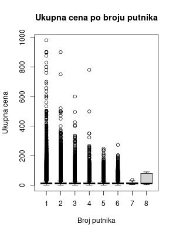

### Analiza zavisnosti atributa passenger_count i tip_status
```{r Analiza zavisnosti atributa passenger_count i tip_status, message=FALSE, warning=FALSE, error=FALSE}
passengerCountTipStatus <- data %>%
    group_by(passenger_count, tip_status) %>%
    summarise(count = n()) %>%
    collect()

kable(passengerCountTipStatus)
```
```{r Vizuelizacija zavisnosti atributa passenger_count i tip_status, include=FALSE, eval=FALSE, message=FALSE, warning=FALSE, error=FALSE}
ppc <- data %>%
    select(passenger_count, tip_status) %>%
    collect()

png("images/passengerCountTipStatus.png", width = 300, height = 400)
mosaicplot(table(ppc), main = "Broj vožnji po broju putnika i načinu plaćanja", xlab = "Broj putnika", ylab = "tip_status", color = c("red", "blue"))
dev.off()
clearFn()
```


### Analiza zavisnosti atributa trip_distance i payment_type
```{r Analiza zavisnosti atributa trip_distance i payment_type, message=FALSE, warning=FALSE, error=FALSE}
tripDistancePaymentType <- data %>%
    group_by(payment_type) %>%
    summarise(min = min(trip_distance), max = max(trip_distance), avg = mean(trip_distance), median = median(trip_distance)) %>%
    collect()
```
```{r Vizuelizacija zavisnosti atributa trip_distance i payment_type, include=FALSE, eval=FALSE, message=FALSE, warning=FALSE, error=FALSE}
tp <- data %>%
    select(trip_distance, payment_type) %>%
    collect()

png("images/tripDistancePaymentType.png", width = 300, height = 400)
boxplot(trip_distance ~ payment_type, data = tp, main = "Dužina putovanja po payment_type-u", xlab = "payment_type", ylab = "Dužina putovanja")
dev.off()
```

### Analiza zavisnosti atributa trip_distance i fare_amount
```{r Vizuelizacija zavisnosti atributa trip_distance i fare_amount, include=FALSE, eval=FALSE, message=FALSE, warning=FALSE, error=FALSE}
tfa <- data %>%
    select(trip_distance, fare_amount) %>%
    collect()

png("images/tripDistanceFareAmount.png", width = 300, height = 400)
plot(tfa, main = "Dužina putovanja po ceni vožnje", xlab = "Dužina putovanja", ylab = "Cena vožnje")
dev.off()
clearFn()
```


### Analiza zavisnosti atributa trip_distance i tip_amount
```{r Vizuelizacija zavisnosti atributa trip_distance i tip_amount, include=FALSE, eval=FALSE, message=FALSE, warning=FALSE, error=FALSE}
tta <- data %>%
    select(trip_distance, tip_amount) %>%
    collect()

png("images/tripDistanceTipAmount.png", width = 300, height = 400)
plot(tta, main = "Dužina putovanja po napojnici", xlab = "Dužina putovanja", ylab = "Napojnica")
dev.off()
clearFn()
```


### Analiza zavisnosti atributa trip_distance i tolls_amount
```{r Vizuelizacija zavisnosti atributa trip_distance i tolls_amount, include=FALSE, eval=FALSE, message=FALSE, warning=FALSE, error=FALSE}
tta <- data %>%
    select(trip_distance, tolls_amount) %>%
    collect()

png("images/tripDistanceTollsAmount.png", width = 300, height = 400)
plot(tta, main = "Dužina putovanja po troškovima putarine", xlab = "Dužina putovanja", ylab = "Troškovi putarine")
dev.off()
clearFn()
```


### Analiza zavisnosti atributa trip_distance i total_amount
```{r Vizuelizacija zavisnosti atributa trip_distance i total_amount, include=FALSE, eval=FALSE, message=FALSE, warning=FALSE, error=FALSE}
tta <- data %>%
    select(trip_distance, total_amount) %>%
    collect()

png("images/tripDistanceTotalAmount.png", width = 300, height = 400)
plot(tta, main = "Dužina putovanja po ukupnoj ceni", xlab = "Dužina putovanja", ylab = "Ukupna cena")
dev.off()
clearFn()
```


### Analiza zavisnosti atributa trip_distance i tip_status
```{r Analiza zavisnosti atributa trip_distance i tip_status, message=FALSE, warning=FALSE, error=FALSE}
tripDistanceTipStatus <- data %>%
    group_by(tip_status) %>%
    summarise(min = min(trip_distance), max = max(trip_distance), avg = mean(trip_distance), median = median(trip_distance)) %>%
    collect()

kable(tripDistanceTipStatus)
```
```{r Vizuelizacija zavisnosti atributa trip_distance i tip_status, include=FALSE, eval=FALSE, message=FALSE, warning=FALSE, error=FALSE}
tpc <- data %>%
    select(trip_distance, tip_status) %>%
    collect()

png("images/tripDistanceTipStatus.png", width = 300, height = 400)
boxplot(trip_distance ~ tip_status, data = tpc, main = "Dužina putovanja po načinu plaćanja", xlab = "Način plaćanja", ylab = "Dužina putovanja")
dev.off()
clearFn()
```
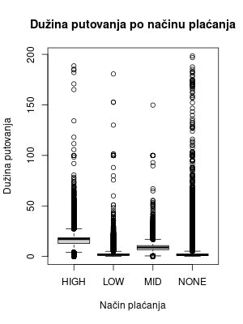

### Analiza zavisnosti atributa payment_type i fare_amount
```{r Analiza zavisnosti atributa payment_type i fare_amount, message=FALSE, warning=FALSE, error=FALSE}
paymentTypeFareAmount <- data %>%
    group_by(payment_type) %>%
    summarise(min = min(fare_amount), max = max(fare_amount), avg = mean(fare_amount), median = median(fare_amount)) %>%
    collect()

kable(paymentTypeFareAmount)
```
```{r Vizuelizacija zavisnosti atributa payment_type i fare_amount, include=FALSE, eval=FALSE, message=FALSE, warning=FALSE, error=FALSE}
pfa <- data %>%
    select(payment_type, fare_amount) %>%
    collect()

png("images/paymentTypeFareAmount.png", width = 300, height = 400)
boxplot(fare_amount ~ payment_type, data = pfa, main = "Cena vožnje po payment_type-u", xlab = "payment_type", ylab = "Cena vožnje")
dev.off()
clearFn()
```


### Analiza zavisnosti atributa payment_type i tip_amount
```{r Analiza zavisnosti atributa payment_type i tip_amount, message=FALSE, warning=FALSE, error=FALSE}
paymentTypeTipAmount <- data %>%
    group_by(payment_type) %>%
    summarise(min = min(tip_amount), max = max(tip_amount), avg = mean(tip_amount), median = median(tip_amount)) %>%
    collect()

kable(paymentTypeTipAmount)
```
```{r Vizuelizacija zavisnosti atributa payment_type i tip_amount, include=FALSE, eval=FALSE, message=FALSE, warning=FALSE, error=FALSE}
pta <- data %>%
    select(payment_type, tip_amount) %>%
    collect()

png("images/paymentTypeTipAmount.png", width = 300, height = 400)
boxplot(tip_amount ~ payment_type, data = pta, main = "Napojnica po payment_type-u", xlab = "payment_type", ylab = "Napojnica")
dev.off()
```
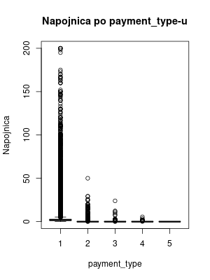

### Analiza zavisnosti atributa payment_type i tolls_amount
```{r Analiza zavisnosti atributa payment_type i tolls_amount, message=FALSE, warning=FALSE, error=FALSE}
paymentTypeTollsAmount <- data %>%
    group_by(payment_type) %>%
    summarise(min = min(tolls_amount), max = max(tolls_amount), avg = mean(tolls_amount), median = median(tolls_amount)) %>%
    collect()

kable(paymentTypeTollsAmount)
```
```{r Vizuelizacija zavisnosti atributa payment_type i tolls_amount, include=FALSE, eval=FALSE, message=FALSE, warning=FALSE, error=FALSE}
pta <- data %>%
    select(payment_type, tolls_amount) %>%
    collect()

png("images/paymentTypeTollsAmount.png", width = 300, height = 400)
boxplot(tolls_amount ~ payment_type, data = pta, main = "Troškovi putarine po payment_type-u", xlab = "payment_type", ylab = "Troškovi putarine")
dev.off()
```


### Analiza zavisnosti atributa payment_type i total_amount
```{r Analiza zavisnosti atributa payment_type i total_amount, message=FALSE, warning=FALSE, error=FALSE}
paymentTypeTotalAmount <- data %>%
    group_by(payment_type) %>%
    summarise(min = min(total_amount), max = max(total_amount), avg = mean(total_amount), median = median(total_amount)) %>%
    collect()

kable(paymentTypeTotalAmount)
```
```{r Vizuelizacija zavisnosti atributa payment_type i total_amount, include=FALSE, eval=FALSE, message=FALSE, warning=FALSE, error=FALSE}
pta <- data %>%
    select(payment_type, total_amount) %>%
    collect()

png("images/paymentTypeTotalAmount.png", width = 300, height = 400)
boxplot(total_amount ~ payment_type, data = pta, main = "Ukupna cena po payment_type-u", xlab = "payment_type", ylab = "Ukupna cena")
dev.off()
clearFn()
```


### Analiza zavisnosti atributa payment_type i tip_status
```{r Analiza zavisnosti atributa payment_type i tip_status, message=FALSE, warning=FALSE, error=FALSE}
paymentTypeTipStatus <- data %>%
    group_by(payment_type, tip_status) %>%
    summarise(count = n()) %>%
    collect()

kable(paymentTypeTipStatus)
```
```{r Vizuelizacija zavisnosti atributa payment_type i tip_status, include=FALSE, eval=FALSE, message=FALSE, warning=FALSE, error=FALSE}
ppc <- data %>%
    select(payment_type, tip_status) %>%
    collect()

png("images/paymentTypeTipStatus.png", width = 300, height = 400)
mosaicplot(table(ppc), main = "Broj vožnji po payment_type-u i načinu plaćanja", xlab = "payment_type", ylab = "tip_status", color = c("red", "blue"))
dev.off()
clearFn()
```


### Analiza zavisnosti atributa fare_amount i tip_amount
```{r Vizuelizacija zavisnosti atributa fare_amount i tip_amount, include=FALSE, eval=FALSE, message=FALSE, warning=FALSE, error=FALSE}
fta <- data %>%
    select(fare_amount, tip_amount) %>%
    collect()

png("images/fareAmountTipAmount.png", width = 300, height = 400)
plot(tip_amount ~ fare_amount, data = fta, main = "Napojnica po ceni vožnje", xlab = "Cena vožnje", ylab = "Napojnica")
dev.off()
clearFn()
```


### Analiza zavisnosti atributa fare_amount i tolls_amount
```{r Vizuelizacija zavisnosti atributa fare_amount i tolls_amount, include=FALSE, eval=FALSE, message=FALSE, warning=FALSE, error=FALSE}
fta <- data %>%
    select(fare_amount, tolls_amount) %>%
    collect()

png("images/fareAmountTollsAmount.png", width = 300, height = 400)
plot(tolls_amount ~ fare_amount, data = fta, main = "Troškovi putarine po ceni vožnje", xlab = "Cena vožnje", ylab = "Troškovi putarine")
dev.off()
clearFn()
```
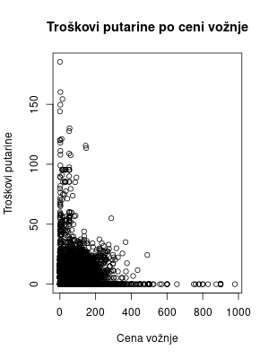

### Analiza zavisnosti atributa fare_amount i total_amount
```{r Vizuelizacija zavisnosti atributa fare_amount i total_amount, include=FALSE, eval=FALSE, message=FALSE, warning=FALSE, error=FALSE}
fta <- data %>%
    select(fare_amount, total_amount) %>%
    collect()

png("images/fareAmountTotalAmount.png", width = 300, height = 400)
plot(total_amount ~ fare_amount, data = fta, main = "Ukupna cena po ceni vožnje", xlab = "Cena vožnje", ylab = "Ukupna cena")
dev.off()
clearFn()
```
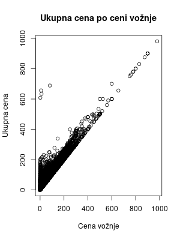

### Analiza zavisnosti atributa fare_amount i tip_status
```{r Analiza zavisnosti atributa fare_amount i tip_status, message=FALSE, warning=FALSE, error=FALSE}
fareAmountTipStatus <- data %>%
    group_by(tip_status) %>%
    summarise(min = min(fare_amount), max = max(fare_amount), avg = mean(fare_amount), median = median(fare_amount)) %>%
    collect()

kable(fareAmountTipStatus)
```
```{r Vizuelizacija zavisnosti atributa fare_amount i tip_status, include=FALSE, eval=FALSE, message=FALSE, warning=FALSE, error=FALSE}
fpc <- data %>%
    select(fare_amount, tip_status) %>%
    collect()

png("images/fareAmountTipStatus.png", width = 300, height = 400)
boxplot(fare_amount ~ tip_status, data = fpc, main = "Cena vožnje po načinu plaćanja", xlab = "Način plaćanja", ylab = "Cena vožnje")
dev.off()
clearFn()
```


### Analiza zavisnosti atributa tip_amount i tolls_amount
```{r Vizuelizacija zavisnosti atributa tip_amount i tolls_amount, include=FALSE, eval=FALSE, message=FALSE, warning=FALSE, error=FALSE}
tta <- data %>%
    select(tip_amount, tolls_amount) %>%
    collect()

png("images/tipAmountTollsAmount.png", width = 300, height = 400)
plot(tolls_amount ~ tip_amount, data = tta, main = "Troškovi putarine po napojnici", xlab = "Napojnica", ylab = "Troškovi putarine")
dev.off()
clearFn()
```


### Analiza zavisnosti atributa tip_amount i total_amount
```{r Vizuelizacija zavisnosti atributa tip_amount i total_amount, include=FALSE, eval=FALSE, message=FALSE, warning=FALSE, error=FALSE}
tta <- data %>%
    select(tip_amount, total_amount) %>%
    collect()

png("images/tipAmountTotalAmount.png", width = 300, height = 400)
plot(total_amount ~ tip_amount, data = tta, main = "Ukupna cena po napojnici", xlab = "Napojnica", ylab = "Ukupna cena")
dev.off()
clearFn()
```


### Analiza zavisnosti atributa tip_amount i tip_status
```{r Analiza zavisnosti atributa tip_amount i tip_status, message=FALSE, warning=FALSE, error=FALSE}
tipAmountTipStatus <- data %>%
    group_by(tip_status) %>%
    summarise(min = min(tip_amount), max = max(tip_amount), avg = mean(tip_amount), median = median(tip_amount)) %>%
    collect()

kable(tipAmountTipStatus)
```
```{r Vizuelizacija zavisnosti atributa tip_amount i tip_status, include=FALSE, eval=FALSE, message=FALSE, warning=FALSE, error=FALSE}
tpc <- data %>%
    select(tip_amount, tip_status) %>%
    collect()

png("images/tipAmountTipStatus.png", width = 300, height = 400)
boxplot(tip_amount ~ tip_status, data = tpc, main = "Napojnica po načinu plaćanja", xlab = "Način plaćanja", ylab = "Napojnica")
dev.off()
clearFn()
```


### Analiza zavisnosti atributa tolls_amount i total_amount
```{r Vizuelizacija zavisnosti atributa tolls_amount i total_amount, include=FALSE, eval=FALSE, message=FALSE, warning=FALSE, error=FALSE}
tta <- data %>%
    select(tolls_amount, total_amount) %>%
    collect()

png("images/tollsAmountTotalAmount.png", width = 300, height = 400)
plot(total_amount ~ tolls_amount, data = tta, main = "Ukupna cena po troškovima putarine", xlab = "Troškovi putarine", ylab = "Ukupna cena")
dev.off()
clearFn()
```


### Analiza zavisnosti atributa tolls_amount i tip_status
```{r Analiza zavisnosti atributa tolls_amount i tip_status, message=FALSE, warning=FALSE, error=FALSE}
tollsAmountTipStatus <- data %>%
    group_by(tip_status) %>%
    summarise(min = min(tolls_amount), max = max(tolls_amount), avg = mean(tolls_amount), median = median(tolls_amount)) %>%
    collect()

kable(tollsAmountTipStatus)
```
```{r Vizuelizacija zavisnosti atributa tolls_amount i tip_status, include=FALSE, eval=FALSE, message=FALSE, warning=FALSE, error=FALSE}
tpc <- data %>%
    select(tolls_amount, tip_status) %>%
    collect()

png("images/tollsAmountTipStatus.png", width = 300, height = 400)
boxplot(tolls_amount ~ tip_status, data = tpc, main = "Troškovi putarine po načinu plaćanja", xlab = "Način plaćanja", ylab = "Troškovi putarine")
dev.off()
clearFn()
```


### Analiza zavisnosti atributa total_amount i tip_status
```{r Vizuelizacija zavisnosti atributa total_amount i tip_status, include=FALSE, eval=FALSE, message=FALSE, warning=FALSE, error=FALSE}
tpc <- data %>%
    select(total_amount, tip_status) %>%
    collect()

png("images/totalAmountTipStatus.png", width = 300, height = 400)
boxplot(total_amount ~ tip_status, data = tpc, main = "Ukupna cena po načinu plaćanja", xlab = "Način plaćanja", ylab = "Ukupna cena")
dev.off()
clearFn()
```


### Matrica korelacije
```{r Matrica korelacije, include=FALSE, eval=FALSE, message=FALSE, warning=FALSE, error=FALSE}
local_df <- data %>% 
    select(-tip_status) %>%
  sdf_sample(fraction = 0.8, replacement = FALSE, seed=1) %>%
  collect()

mt <- cor(cor(local_df))

p <- ggcorrplot(mt, 
        hc.order = TRUE,
        type = "lower",
        lab = TRUE, 
        ggtheme = ggplot2::theme_gray,
        colors = c("#123456", "white", "#654321"))

ggsave("images/MatricaKorelacije.png", p)
clearFn()
```
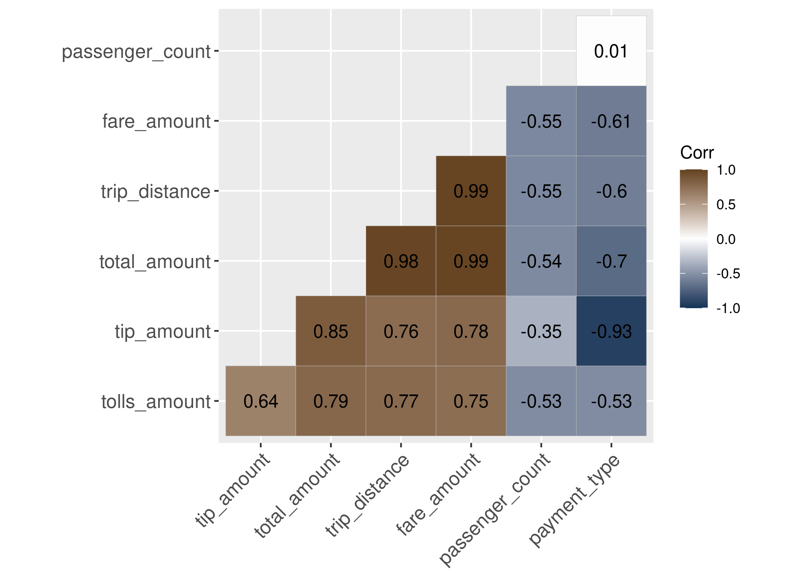

# Klasifikacija
## Priprema podataka
```{r Priprema podataka 1, message=FALSE, warning=FALSE, error=FALSE}
means <- data %>%
    summarise_all(mean) %>%
    collect()

sds <- data %>%
    summarise_all(sd) %>%
    collect()
 
standardized_data <- data %>%
    mutate(trip_distance = (trip_distance - means$trip_distance) / sds$trip_distance,
           fare_amount = (fare_amount - means$fare_amount) / sds$fare_amount,
           tolls_amount = (tolls_amount - means$tolls_amount) / sds$tolls_amount,
           total_amount = (total_amount - means$total_amount) / sds$total_amount)

split_data <- sdf_random_split(standardized_data, training = 0.8, test = 0.2, seed = 1)
```
### Ciljno obeležje i prediktori
```{r Ciljno obeležje i prediktori, message=FALSE, warning=FALSE, error=FALSE}
formula <- tip_status ~ trip_distance + fare_amount + tolls_amount + total_amount + passenger_count + payment_type
```
### Funkcija za čišćenje memorije
```{r Funkcija za čišćenje memorije 2, results='hide', message=FALSE, warning=FALSE, error=FALSE}
clearFn <- function() {
    all_objects <- ls()
    needed_to_keep <- c("sc", "ds.df", "ds.filtered", "data", "conf", "clearFn", "split_data", "formula", "standardized_data")
    to_remove <- setdiff(all_objects, needed_to_keep)
    rm(list = to_remove)
}
```
## Logistička regresija
### Obučavanje i evaluacija modela
```{r Logistička regresija, eval=FALSE, message=FALSE, warning=FALSE, error=FALSE}
smp <- c(1:3)
max.iter <- smp * 5

log.precision <- smp
log.recall <- smp
log.fmeasure <- smp
log.accuracy <- smp

for(i in smp){
    model <- ml_logistic_regression(split_data$train, formula, max_iter=max.iter[[i]])
    eval <- ml_evaluate(model, split_data$test)
    log.precision[i] <- eval$weighted_precision()
    log.recall[i] <- eval$weighted_recall()
    log.fmeasure[i] <- eval$weighted_f_measure()
    log.accuracy[i] <- eval$accuracy()
}
```
### Prikaz zavisnosti
```{r Prikaz zavisnosti 1, include=FALSE, eval=FALSE, message=FALSE, warning=FALSE, error=FALSE}
logistic_metrics <- data.frame(i=max.iter, wp=log.precision, wr=log.recall, wf=log.fmeasure, acc=log.accuracy)

p1 <- logistic_metrics %>%
ggplot(aes(i, wp, color=wp)) +
  geom_line(size=2) +
  scale_x_continuous(breaks=max.iter) +
  scale_y_continuous(breaks=log.precision) +
  labs(x="Maksimalni broj iteracija", y="Preciznost", title = "Zavisnost preciznosti od maksimalnog broja iteracija")
ggsave("images/logPrecIter.png", p1)

p2 <- logistic_metrics %>%
ggplot(aes(i, wr, color=wr)) +
  geom_line(size=2) +
  scale_x_continuous(breaks=max.iter) +
  scale_y_continuous(breaks=log.recall) +
  labs(x="Maksimalni broj iteracija", y="Osetljivost", title = "Zavisnost osetljivosti od maksimalnog broja iteracija")
ggsave("images/logRecIter.png", p2)

p3 <- logistic_metrics %>%
  ggplot(aes(i, wf, color=wf)) +
  geom_line(size=2) +
  scale_x_continuous(breaks=max.iter) +
  scale_y_continuous(breaks=log.fmeasure) +
  labs(x="Maksimalni broj iteracija", y="F1", title = "Zavisnost F1 mere od maksimalnog broja iteracija")
ggsave("images/logF1Iter.png", p3)

p4 <- logistic_metrics %>%
  ggplot(aes(i, acc, color=acc)) +
  geom_line(size=2) +
  scale_x_continuous(breaks=max.iter) +
  scale_y_continuous(breaks=log.accuracy) +
  labs(x="Maksimalni broj iteracija", y="Tacnost", title = "Zavisnost tacnosti od maksimalnog broja iteracija")
ggsave("images/logAccIter.png", p4)
```

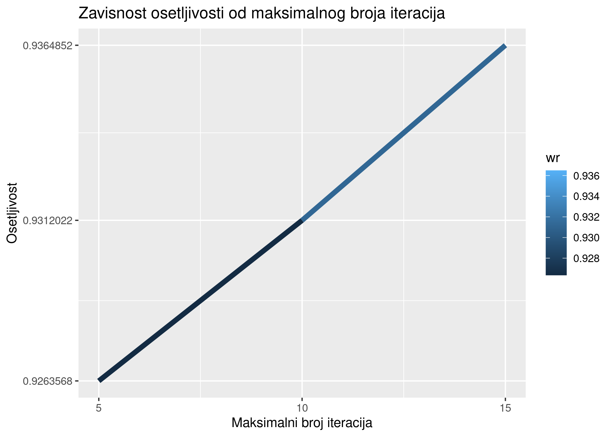
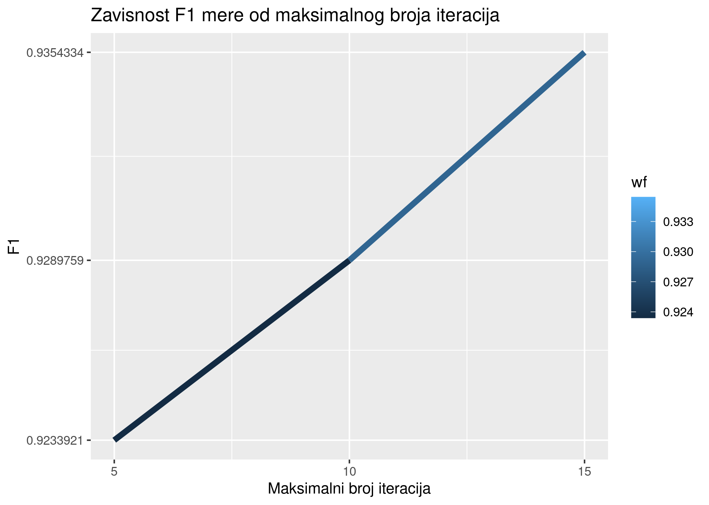


### Validacija
```{r Validacija 1, eval=FALSE, message=FALSE, warning=FALSE, error=FALSE}
pip <- sc %>% 
    ml_pipeline() %>%
    ft_r_formula(formula) %>%
    ml_logistic_regression()

param_grid <- list(
  logistic_regression = list(max_iter = max.iter)
)

evaluator <- ml_multiclass_classification_evaluator(x=sc, metric_name="accuracy")
validator <- ml_cross_validator(x=sc, estimator=pip, evaluator=evaluator, estimator_param_maps=param_grid, num_folds=4)
fit <- ml_fit(x=validator, dataset=standardized_data)
metrics <- ml_validation_metrics(fit)

p <- metrics %>% 
  ggplot(aes(max.iter, accuracy)) + 
  geom_line()

ggsave("images/logKFolds.png", p)
clearFn()
```


### Odabir modela
Model sa najviše iteracija pokazao je najbolje rezultate (najbolju preciznost, f1, tačnost, osetljivost) prilikom testiranja 
i najbolju tačnost prilikom k-fold unakrsnog validiranja sa k=4.
Time, biramo model sa 15 iteracija.

## Stablo odlučivanja
### Obučavanje i evaluacija modela
```{r Stablo odlučivanja, eval=FALSE, message=FALSE, warning=FALSE, error=FALSE}
smp <- c(1:3)
max.depth <- smp * 5

dt.accuracy <- smp
dt.sensitivity <- smp
dt.fmeasure <- smp

for(i in smp){
    model <- ml_decision_tree_classifier(split_data$train, formula, max_depth=max.depth[[i]])
    eval <- ml_evaluate(model, split_data$test)

    dt.accuracy[i] <- eval$Accuracy
}
```
### Prikaz zavisnosti
```{r Prikaz zavisnosti 2, include=FALSE, eval=FALSE, message=FALSE, warning=FALSE, error=FALSE}
decision_tree_metrics <- data.frame(i=max.depth, acc=dt.accuracy)

p <- decision_tree_metrics %>%
  ggplot(aes(i, acc, color=acc)) +
  geom_line(size=2) +
  scale_x_continuous(breaks=max.depth) +
  scale_y_continuous(breaks=log.accuracy) +
  labs(x="Maksimalna dubina stabla", y="Tacnost", title = "Zavisnost tacnosti od maksimalnog dubine stabla")

ggsave("images/dtAccDepth.png", p)
```


### Validacija
```{r Validacija 2, eval=FALSE, message=FALSE, warning=FALSE, error=FALSE}
pip <- sc %>% 
    ml_pipeline() %>%
    ft_r_formula(formula) %>%
    ml_decision_tree_classifier()

param_grid <- list(
  decision_tree_classifier = list(max_depth = max.depth)
)

evaluator <- ml_multiclass_classification_evaluator(x=sc, metric_name="accuracy")
validator <- ml_cross_validator(x=sc, estimator=pip, evaluator=evaluator, estimator_param_maps=param_grid, num_folds=4)
fit <- ml_fit(x=validator, dataset=standardized_data)
metrics <- ml_validation_metrics(fit)

p <- metrics %>% 
  ggplot(aes(max.depth, accuracy)) + 
  geom_line()

ggsave("images/dtKFolds.png", p)
clearFn()
```
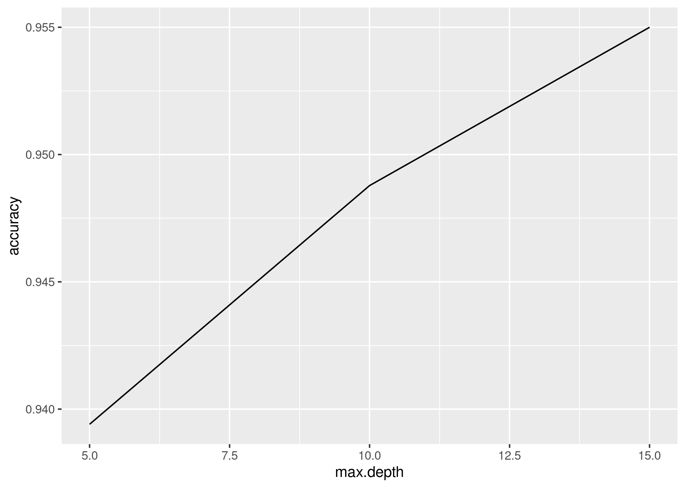

### Odabir modela
Model sa najvećom dubinom stabla pokazao je najbolje rezultate (najbolju preciznost, f1, tačnost, osetljivost) prilikom testiranja
i najbolju tačnost prilikom k-fold unakrsnog validiranja sa k=4.
Time, biramo model sa maksimalnom dubinom stabla od 15.

## Random forest
### Obučavanje i evaluacija modela
```{r Random forest, eval=FALSE, message=FALSE, warning=FALSE, error=FALSE}
smp <- c(1:3)
num.trees <- smp * 5

rf.accuracy <- smp

for(i in smp){
    model <- ml_random_forest_classifier(split_data$train, formula, num_trees=num.trees[[i]])
    eval <- ml_evaluate(model, split_data$test)

    rf.accuracy[i] <- eval$Accuracy
}
```

### Prikaz zavisnosti
```{r Prikaz zavisnosti 3, include=FALSE, eval=FALSE, message=FALSE, warning=FALSE, error=FALSE}
random_forest_metrics <- data.frame(i=num.trees, acc=rf.accuracy)

p <- random_forest_metrics %>%
  ggplot(aes(i, acc, color=acc)) +
  geom_line(size=2) +
  scale_x_continuous(breaks=num.trees) +
  scale_y_continuous(breaks=rf.accuracy) +
  labs(x="Broj stabala", y="Tacnost", title = "Zavisnost tacnosti od broja stabala")

ggsave("images/rfAccTrees.png", p)
```


### Validacija
```{r Validacija 3, eval=FALSE, message=FALSE, warning=FALSE, error=FALSE}
pip <- sc %>% 
    ml_pipeline() %>%
    ft_r_formula(formula) %>%
    ml_random_forest_classifier()

param_grid <- list(
    random_forest_classifier = list(num_trees = num.trees)
    )

evaluator <- ml_multiclass_classification_evaluator(x=sc, metric_name="accuracy")
validator <- ml_cross_validator(x=sc, estimator=pip, evaluator=evaluator, estimator_param_maps=param_grid, num_folds=4)
fit <- ml_fit(x=validator, dataset=standardized_data)
metrics <- ml_validation_metrics(fit)

p <- metrics %>% 
  ggplot(aes(num.trees, accuracy)) + 
  geom_line()

ggsave("images/rfKFolds.png", p)
clearFn()
```


### Odabir modela
Model sa najmanjim brojem stabala pokazao je najbolje tačnost prilikom testiranja
i najbolju tačnost prilikom k-fold unakrsnog validiranja sa k=4.
Time, biramo model sa 5 stabala.

# Klasterizacija
## Priprema podataka
```{r Priprema podataka 2, message=FALSE, warning=FALSE, error=FALSE}
means <- data %>%
    summarise_all(mean) %>%
    collect()

sds <- data %>%
    summarise_all(sd) %>%
    collect()
 
standardized_data <- data %>%
    select(total_amount, passenger_count, payment_type) %>%
    mutate(passenger_count = (passenger_count - means$passenger_count) / sds$passenger_count,
           payment_type = (payment_type - means$payment_type) / sds$payment_type,
           total_amount = (total_amount - means$total_amount) / sds$total_amount)

features <- standardized_data
formula <- ~ total_amount + passenger_count + payment_type
```

### Funkcija za čišćenje memorije
```{r Funkcija za čišćenje memorije 3, results='hide', message=FALSE, warning=FALSE, error=FALSE}
clearFn <- function() {
    all_objects <- ls()
    needed_to_keep <- c("sc", "ds.df", "ds.filtered", "data", "conf", "clearFn", "features", "standardized_data", "sds", "means", "formula")
    to_remove <- setdiff(all_objects, needed_to_keep)
    rm(list = to_remove)
}
```

## K-means
### Biranje K
```{r Biranje K, eval=FALSE, message=FALSE, warning=FALSE, error=FALSE}
clustered <- list()
for(k in 2:10) {
  clustered[[k]] <- features %>% ml_bisecting_kmeans(formula=formula, k = k, max_iter = 10)
}

k_errors <- numeric(10)
for(i in 2:10) {
  k_errors[i] <- clustered[[i]]$cost
}
k_errors_df <- data.frame(i=1:10, e=k_errors)

k_elbow_plot <- ggplot(k_errors_df) +
  geom_line(mapping = aes(x = i, y = e)) +
  scale_x_continuous(breaks = 1:10) +
  labs(title = "Suma gresaka kvadrata prema broju klastera",
       x = "Broj klastera",
       y = "Suma gresaka") +
  theme_bw() 
ggsave("images/kElbowPlot.png", k_elbow_plot)
clearFn()
```
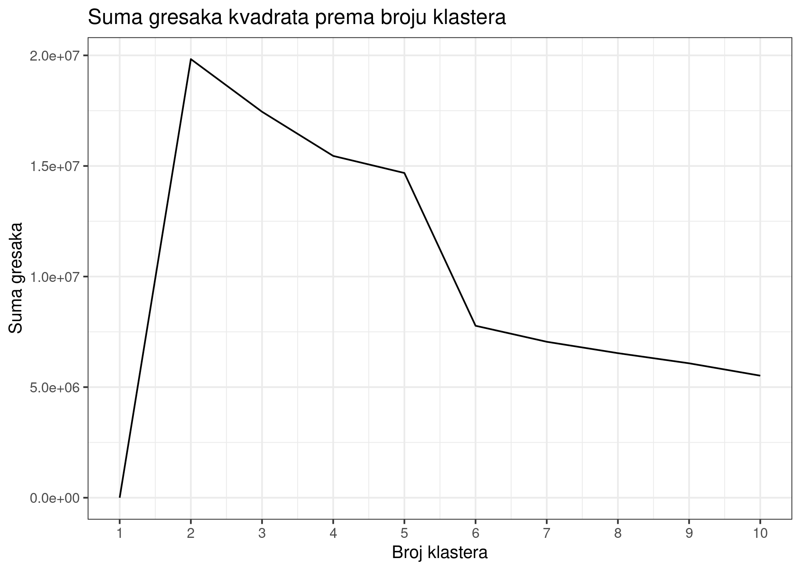

Pregledanjem grafika, velike promene se dešavaju na k=4 i k=6, čime su izabrane 
za parametre.

### Obučavanje
Za obučavanje su odabrani modeli sa k=4 i k=6.
```{r Obučavanje, message=FALSE, warning=FALSE, error=FALSE}
kmeans_models <- list()
kmeans_predictions <- list()
smp <- c(1:2)
ks <- c(4,6)
for(i in smp) {
    kmeans_models[[i]] <- features %>% ml_bisecting_kmeans(formula=formula, k = ks[[i]])
    kmeans_predictions[[i]] <- ml_predict(kmeans_models[[i]], features)
}

kmeans_models[[1]]
kmeans_models[[2]]
```

### Izračunavanje vrednosti klastera
```{r Izračunavanje vrednosti klastera, message=FALSE, warning=FALSE, error=FALSE}
kmeans.means <- list()
kmeans.medians <- list()
kmeans.counts <- list()

for(i in smp) {
    tmp <- kmeans_predictions[[i]] %>% select(-features, -payment_type) %>% mutate(total_amount = total_amount * sds$total_amount + means$total_amount,
                  passenger_count = passenger_count * sds$passenger_count + means$passenger_count) 

    kmeans.means[[i]] <- tmp %>%
        group_by(prediction) %>% 
        summarise_all(mean) %>% 
        arrange(prediction) %>% 
        collect()

    kmeans.medians[[i]] <- tmp %>%
        group_by(prediction) %>% 
        summarise_all(median) %>% 
        arrange(prediction) %>% 
        collect()

    kmeans.counts[[i]] <- tmp %>%
        group_by(prediction) %>% 
        summarise(count = n()) %>% 
        arrange(prediction) %>% 
        collect()
}

kable(kmeans.means[[1]], caption=paste0("K-means aritmeticke sredine sa k=", ks[[1]]))
kable(kmeans.medians[[1]], caption=paste0("K-means medijane sa k=", ks[[1]]))
kable(kmeans.counts[[1]], caption=paste0("K-means broj sa k=", ks[[1]]))
kable(kmeans.means[[2]], caption=paste0("K-means aritmeticke sredine sa k=", ks[[2]]))
kable(kmeans.medians[[2]], caption=paste0("K-means medijane sa k=", ks[[2]]))
kable(kmeans.counts[[2]], caption=paste0("K-means broj sa k=", ks[[2]]))
clearFn()
```

### Prikaz odnosa obeležja i pripadnosti klasterima
```{r Prikaz klastera, include=FALSE, eval=FALSE, message=FALSE, warning=FALSE, error=FALSE}
for(i in smp) {
    tmp <- kmeans_predictions[[i]] %>% select(payment_type, prediction) %>% mutate(payment_type = payment_type * sds$payment_type + means$payment_type) %>% collect()
    png(paste0("images/kmeans_payment_type_", ks[[i]], ".png"), width = 300, height = 400)
    boxplot(payment_type ~ prediction, data = tmp, main = paste0("K-means klaster sa k=", ks[[i]]), xlab = "Klaster", ylab = "Tip plaćanja")
    dev.off()

    tmp <- kmeans_predictions[[i]] %>% select(total_amount, prediction) %>% mutate(total_amount = total_amount * sds$total_amount + means$total_amount) %>% collect()
    png(paste0("images/kmeans_total_amount_", ks[[i]], ".png"), width = 300, height = 400)
    boxplot(total_amount ~ prediction, data = tmp, main = paste0("K-means klaster sa k=", ks[[i]]), xlab = "Klaster", ylab = "Potpuna cena")
    dev.off()

    tmp <- kmeans_predictions[[i]] %>% select(passenger_count, prediction) %>% mutate(passenger_count = passenger_count * sds$passenger_count + means$passenger_count) %>% collect()
    png(paste0("images/kmeans_passenger_count_", ks[[i]], ".png"), width = 300, height = 400)
    boxplot(passenger_count ~ prediction, data = tmp, main = paste0("K-means klaster sa k=", ks[[i]]), xlab = "Klaster", ylab = "Broj putnika")
    dev.off()
}
clearFn()
```


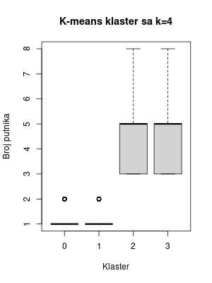
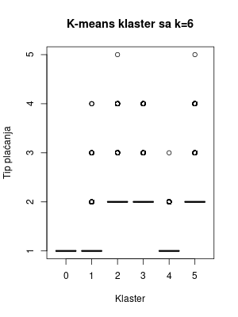

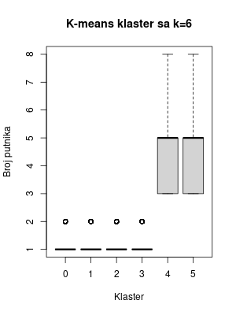

# Otkačivanje sa Spark sesije
```{r Otkačivanje, message=FALSE, warning=FALSE, error=FALSE}
spark_disconnect(sc)
rm(list = ls())
```